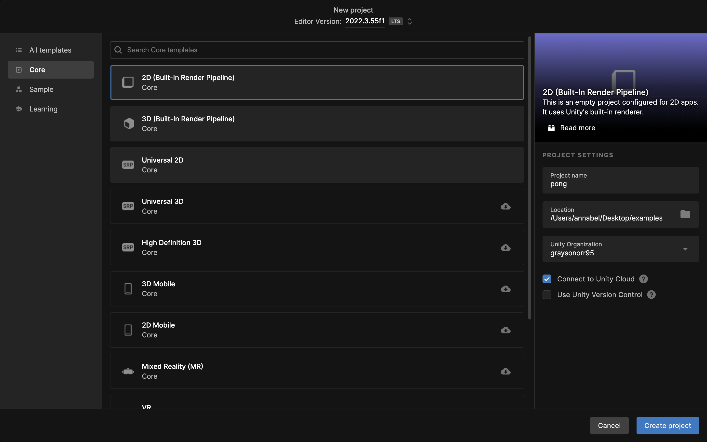
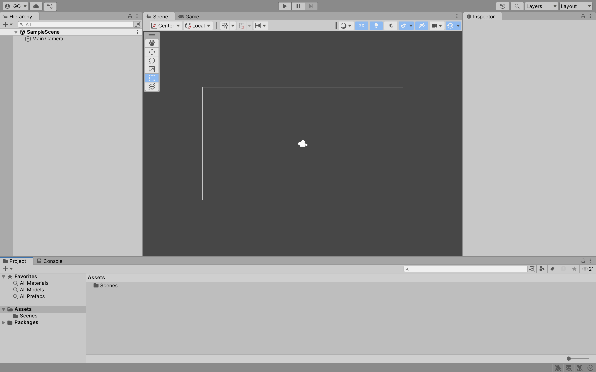
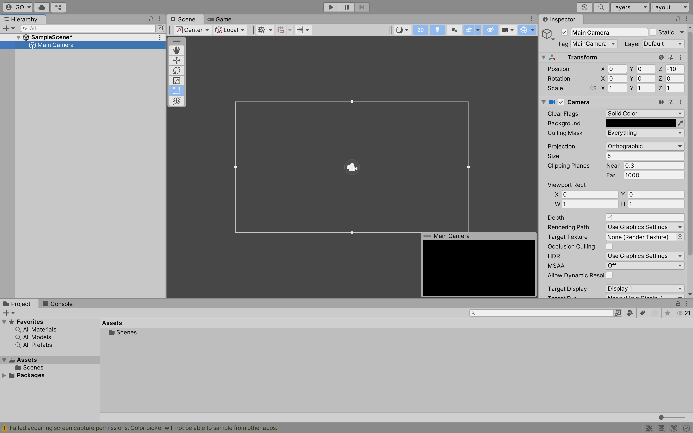
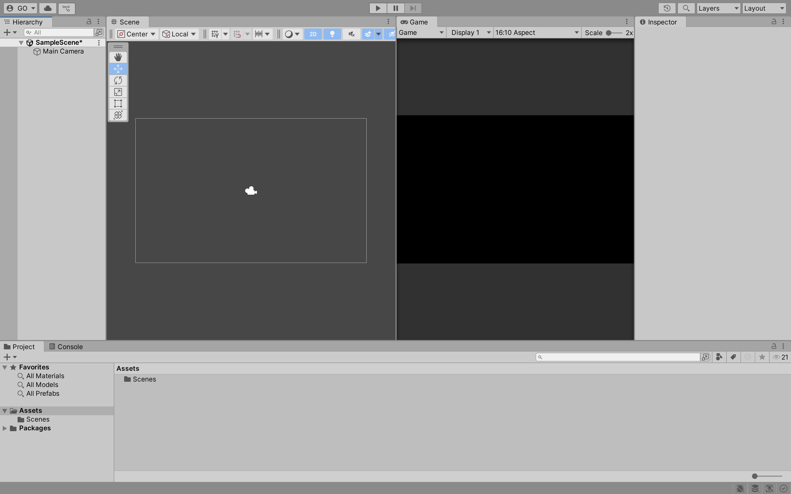
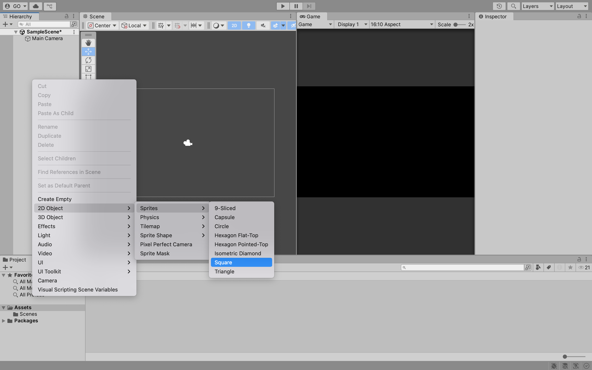

# Week 01

## GitHub

This course will use **GitHub** and **GitHub Classroom** to manage our development. Begin by clicking this link <>. You will be prompted to accept an assignment. Click on the **Accept this assignment** button. **GitHub Classroom** will create a new repository. You will use this repository to submit your formative (non-graded) and summative (graded) assessments.

---

### Development Workflow

By default, **GitHub Classroom** creates an empty repository. Firstly, you must create a **README** and `.gitignore` file. **GitHub** allows new files to be created once the repository is created.

---

### Create a README

Click the **Add file** button, then the **Create new file** button. Name your file `README.md` (Markdown), then click on the **Commit new file** button. You should see a new file in your formative assessments repository called `README.md` and the `main` branch.

> **Resource:** <https://guides.github.com/features/mastering-markdown/>

---

### Create a .gitignore File

Like before, click the **Add file** button and then the **Create new file** button. Name your file `.gitignore`. A `.gitignore` template dropdown will appear on the right-hand side of the screen. Select the **Unity** `.gitignore` template. Click on the **Commit new file** button. You should see a new file in your formative assessments repository called `.gitignore`.

> **Resource:** <https://git-scm.com/docs/gitignore>

---

### Clone a Repository

Open up **Git Bash** or whatever alternative you see fit on your computer. Clone your formative assessments repository to a location on your computer using the command: `git clone <repository URL>`.

> **Resource:** <https://git-scm.com/docs/git-clone>

---

### Commit Message Conventions

You should follow the **conventional commits** convention when committing changes to your repository. A **conventional commit** consists of a **type**, **scope** and **description**. The **type** and **description** are mandatory, while the **scope** is optional. The **type** must be one of the following:

- **build**: Changes that affect the build system or external dependencies
- **chore**: Regular code maintenance, such as refactoring or updating dependencies
- **ci**: Changes to our CI configuration files and scripts
- **docs**: Documentation only changes
- **feat**: A new feature
- **fix**: A bug fix
- **perf**: A code change that improves performance
- **refactor**: A code change that neither fixes a bug nor adds a feature
- **style**: Changes that do not affect the meaning of the code (white-space, formatting, missing semi-colons, etc)
- **test**: Adding missing tests or correcting existing tests

The **scope** is a phrase describing the codebase section affected by the change. For example, you can use the scope `javascript` if you are working on the **formative assessment** for **JavaScript**. If you are working on the **formative assessment** for **HTML**, use the scope `html`.

The **description** is a short description of the change. It should be written in the imperative mood, meaning it should be written as if you are giving a command or instruction. For example, "add a new feature" instead of "added a new feature".

Here are some examples of **conventional commits**:

- `feat(javascript): add a new feature`
- `fix(html): fix a bug`
- `docs(css): update documentation`

> **Resource:** <https://www.conventionalcommits.org/en/v1.0.0/>

---

## Pong 1

In **ID511001: Programming 2**, you developed **Pong** using **Windows Forms Application**. In this module, you will develop **Pong** using **Unity**. In the **Portfolio** assessment, you will extend the basic functionality of **Pong**.

---

## Unity 

**Unity** is a cross-platform game engine and integrated development environment developed by **Unity Technologies**. It is used to develop 2D, 3D, augmented reality (AR) and virtual reality (VR) games. It is known for being user-friendly, making it an excellent choice for beginners.

---

### Unity Hub

**Unity Hub** is a management tool that allows you to manage multiple **Unity** projects. It also allows you to install different versions of **Unity**. You can download **Unity Hub** from the following link: <https://unity.com/download>.

---

### Unity Version

For this module, you should use **Unity 2022.3.57f1**. You can download this version from the following link: <https://unity3d.com/get-unity/download/archive>.

---

### Unity Project

Open **Unity Hub** and click on the **New project** button. 

Select the **2D (Built-In Render Pipeline)** template, name your project `pong` and select a location to save your project. Click on the **Create project** button.

---

### Unity Interface

The **Unity** interface consists of several windows. The **Scene** window is where you can view and edit your game world. The **Hierarchy** window displays all the objects in your scene. The **Project** window displays all the assets in your project. The **Inspector** window displays the properties of the selected object. The **Console** window displays messages from **Unity**.

--- 

### Main Camera

The **Main Camera** is the camera that renders the scene. It is automatically created when you create a new project. You can adjust the **Main Camera** settings in the **Inspector** window. 

**Task:** Change the **Background** colour of the **Main Camera** to **black**.

---

### Move Window

You can move the windows in **Unity** by clicking on the **tab** of the window and dragging it to a new location. For example, you can move the **Game** window to the right-hand side of the **Scene** window.

---

### Sprite

To create a **Sprite**, right-click in the **Hierarchy** window, then select **2D Object** and **Sprite**. 

---

### Rigid Body 

---

### Collider

---

### Player Controller

---

### Ball Controller

---

### Physic Material

---

### Tag

---

### Reset Ball

---

### Game Manager

---

### Canvas

---

### Text

## Formative Assessment

Learning to use AI tools is an important skill. While AI tools are powerful, you **must** be aware of the following:

- If you provide an AI tool with a prompt that is not refined enough, it may generate a not-so-useful response
- Do not trust the AI tool's responses blindly. You **must** still use your judgement and may need to do additional research to determine if the response is correct
- Acknowledge what AI tool you have used. In the assessment's repository **README.md** file, please include what prompt(s) you provided to the AI tool and how you used the response(s) to help you with your work

---

### Submission

Create a new pull request and assign **grayson-orr** to review your practical submission. Please do not merge your own pull request.

---

## Next Class

Link to the next class: [Week 02]()