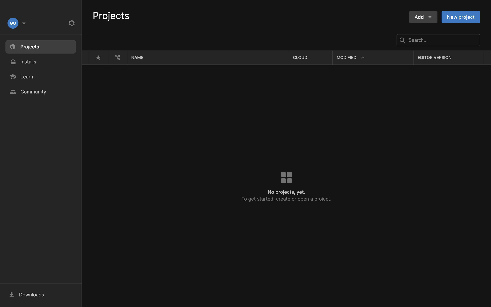
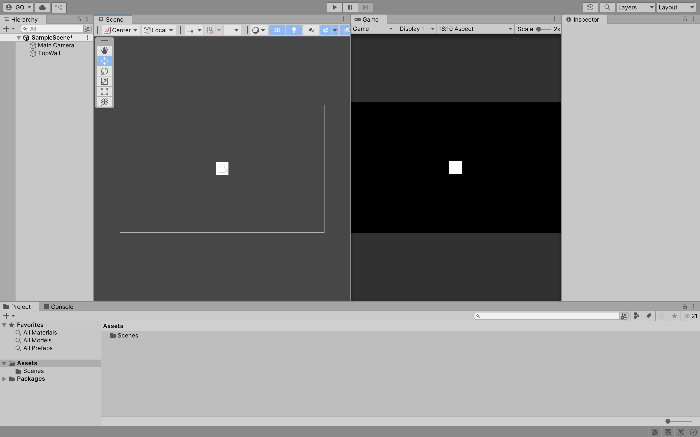
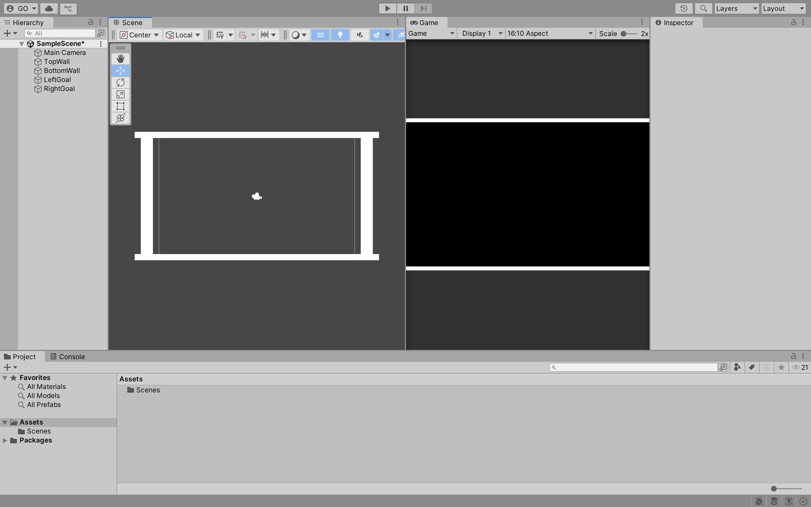
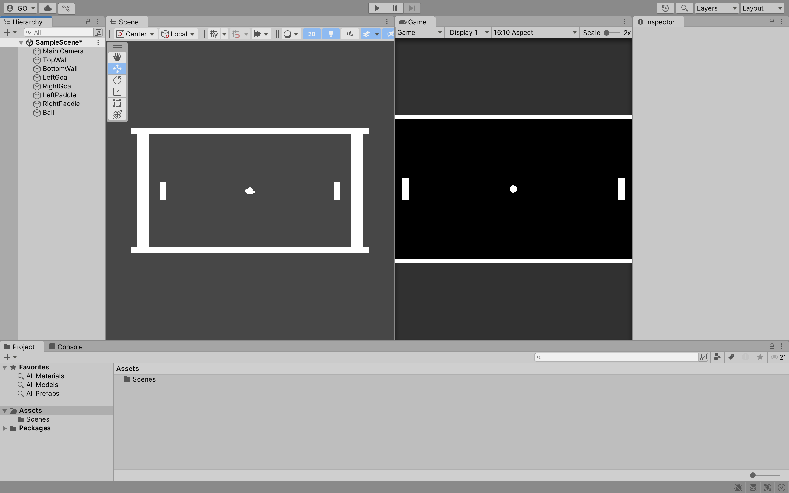
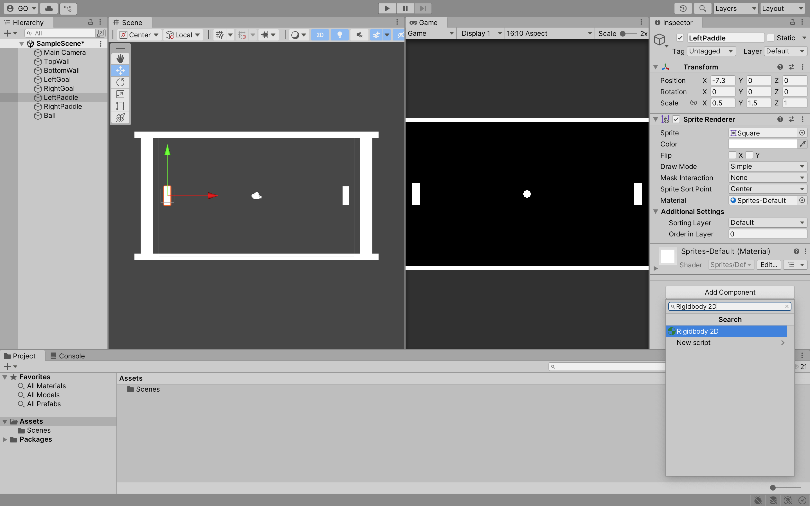
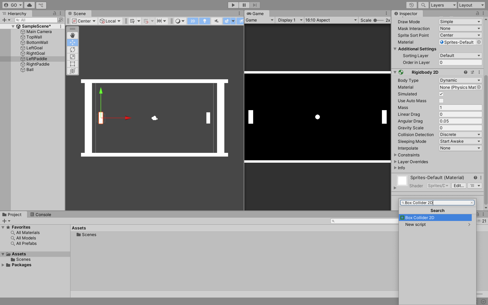
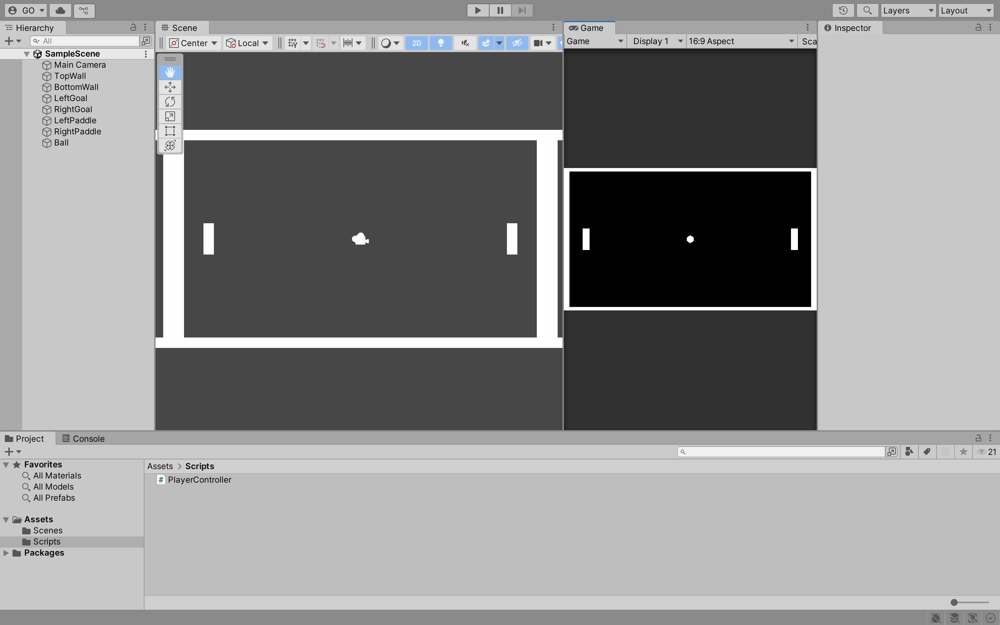
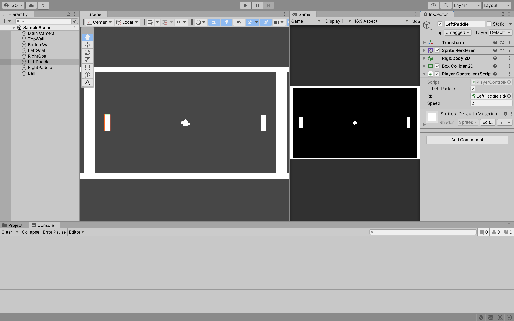

# Week 01

## GitHub

This course will use **GitHub** and **GitHub Classroom** to manage our development. Begin by clicking this link [https://classroom.github.com/a/UvdYWSlH](https://classroom.github.com/a/UvdYWSlH). You will be prompted to accept an assignment. Click on the **Accept this assignment** button. **GitHub Classroom** will create a new repository. You will use this repository to submit your formative (non-graded) and summative (graded) assessments.

---

### Development Workflow

By default, **GitHub Classroom** creates an empty repository. Firstly, you must create a **README** and `.gitignore` file. **GitHub** allows new files to be created once the repository is created.

---

### Create a README

Click the **Add file** button, then the **Create new file** button. Name your file `README.md` (Markdown), then click on the **Commit new file** button. You should see a new file in your formative assessments repository called `README.md` and the `main` branch.

> **Resource:** <https://guides.github.com/features/mastering-markdown/>

---

### Create a .gitignore File

Like before, click the **Add file** button and then the **Create new file** button. Name your file `.gitignore`. A `.gitignore` template dropdown will appear on the right-hand side of the screen. Select the **Unity** `.gitignore` template. Click on the **Commit new file** button. You should see a new file in your formative assessments repository called `.gitignore`.

> **Resource:** <https://git-scm.com/docs/gitignore>

---

### Clone a Repository

Open up **Git Bash** or whatever alternative you see fit on your computer. Clone your formative assessments repository to a location on your computer using the command: `git clone <repository URL>`.

> **Resource:** <https://git-scm.com/docs/git-clone>

---

### Commit Message Conventions

You should follow the **conventional commits** convention when committing changes to your repository. A **conventional commit** consists of a **type**, **scope** and **description**. The **type** and **description** are mandatory, while the **scope** is optional. The **type** must be one of the following:

- **build**: Changes that affect the build system or external dependencies
- **chore**: Regular code maintenance, such as refactoring or updating dependencies
- **ci**: Changes to our CI configuration files and scripts
- **docs**: Documentation only changes
- **feat**: A new feature
- **fix**: A bug fix
- **perf**: A code change that improves performance
- **refactor**: A code change that neither fixes a bug nor adds a feature
- **style**: Changes that do not affect the meaning of the code (white-space, formatting, missing semi-colons, etc)
- **test**: Adding missing tests or correcting existing tests

The **scope** is a phrase describing the codebase section affected by the change. For example, you can use the scope `pong` if you are working on the **formative assessment** for **Pong**. If you are working on the **formative assessment** for **Space Invaders**, use the scope `space invaders`.

The **description** is a short description of the change. It should be written in the imperative mood, meaning it should be written as if you are giving a command or instruction. For example, "add a new feature" instead of "added a new feature".

Here are some examples of **conventional commits**:

- `feat(pong): add a new feature`
- `fix(space invaders): fix a bug`
- `docs(breakout): update documentation`

> **Resource:** <https://www.conventionalcommits.org/en/v1.0.0/>

---

## Pong Game

In **ID511001: Programming 2**, you developed **Pong** using **Windows Forms Application**. In this module, you will develop **Pong** using **Unity**. In the **Portfolio** assessment, you will extend the basic functionality of **Pong**.

---

## Unity 

**Unity** is a cross-platform game engine and integrated development environment developed by **Unity Technologies**. It is used to develop 2D, 3D, augmented reality (AR) and virtual reality (VR) games. It is known for being user-friendly, making it an excellent choice for beginners.

---

### Unity Hub

**Unity Hub** is a management tool that allows you to manage multiple **Unity** projects. It also allows you to install different versions of **Unity**. You can download **Unity Hub** from the following link: <https://unity.com/download>.

---

### Unity Version

For this module, you should use **Unity 6**. You can download this version from the following link: <https://unity.com/releases/unity-6>.


---

### Unity Project

Open **Unity Hub** and click on the **New project** button. 



Select the **2D (Built-In Render Pipeline)** template, name your project `pong` and select a location to save your project. Click on the **Create project** button.


---

### Unity Interface

The **Unity** interface consists of several windows. The **Scene** window is where you can view and edit your game world. The **Hierarchy** window displays all the objects in your scene. The **Project** window displays all the assets in your project. The **Inspector** window displays the properties of the selected object. The **Console** window displays messages from **Unity**.


--- 

## Main Camera

The **Main Camera** is the camera that renders the scene. It is automatically created when you create a new project. You can adjust the **Main Camera** settings in the **Inspector** window. 

**Task:** Change the **Background** colour of the **Main Camera** to **black**.


---

## Move Window

You can move the windows in **Unity** by clicking on the **tab** of the window and dragging it to a new location. For example, you can move the **Game** window to the right-hand side of the **Scene** window.


---

## Sprite

To create a **Sprite**, right-click in the **Hierarchy** window, then select **2D Object** > **Sprites** > **Square**. 


You are going to create the top wall of the **Pong** game. Name the **Sprite** `TopWall`.



Click on the `TopWall` **Sprite** in the **Hierarchy** window. In the **Inspector** window, you should see the **Transform** and **Sprite Renderer** components. 

The **Transform** component is used to store the **Position**, **Rotation** and **Scale** of the **Sprite**. The **Sprite Renderer** component is used to render the **Sprite**.

**Tasks:** 

1. For the `TopWall` **Sprite**, change the Y **Position** to **5**, X **Scale** to **20** and Y **Scale** to **0.5**.
2. Create the bottom wall, left goal and right goal **Sprites**. The left goal and right goal should be slightly off the camera view.

After completing the tasks, your **Scene** window should look like this:



Now, you have the walls and goals for the **Pong** game. Next, you will create the paddles and ball.

**Tasks:**

1. Create the left paddle **Sprite**. Name the **Sprite** `LeftPaddle`. Change the X **Position** to **-7.3**, X **Scale** to **0.5** and Y **Scale** to **1.5**.
2. Create the ball **Sprite** using **2D Object** > **Sprites** > **Circle**. Change the X **Scale** to **0.5** and Y **Scale** to **0.5**

After completing the tasks, your **Scene** window should look like this:



---

## Rigidbody 2D

In **ID511001: Programming 2**, you wrote the code to move the paddles and ball. In **Unity**, you can use the **Rigidbody 2D** component to interact with the physics engine. This means you do not have to write the code to move the paddles and ball.

To add a **Rigidbody 2D** component to a **Sprite**, i.e., `LeftPaddle` **Sprite**, click on the **Sprite** in the **Hierarchy** window, then click on the **Add Component** button in the **Inspector** window. Search for **Rigidbody 2D** and click on it.



Click the **Play** button to run the game. You should see the `LeftPaddle` **Sprite** fall due to gravity.

**Tasks:**

1. To prevent the `LeftPaddle` **Sprite** from falling, change the **Gravity Scale** to **0** in the **Rigidbody 2D** component.
2. Add a **Rigidbody 2D** component to the `RightPaddle` **Sprite**. Also, change the **Gravity Scale** to **0**.

Click the **Play** button to run the game. You should see the `LeftPaddle` and `RightPaddle` **Sprites** not falling due to gravity.

---

## Collider 2D

To detect collisions between **Sprites**, you need to add a **Collider 2D** component to the **Sprites**.

To add a **Collider 2D** component to a **Sprite**, i.e., `LeftPaddle` **Sprite**, click on the **Sprite** in the **Hierarchy** window, then click on the **Add Component** button in the **Inspector** window. Search for **Box Collider 2D** and click on it.



Click the **Play** button to run the game. You should see the `LeftPaddle` **Sprite** collide with the `BottomWall` **Sprite**.

**Tasks:**

1. Add a **Box Collider 2D** component to the `TopWall`, `BottomWall`, `LeftGoal` and `RightGoal` **Sprites**.
2. Add a **Circle Collider 2D** component to the `Ball` **Sprite**.

How do you know if the **Colliders** are applied correctly? You can click on a **Sprite** in the **Hierarchy** window, then click on the **Box Collider 2D** or **Circle Collider 2D** > **Edit Collider** button in the **Inspector** window. You should see the **Collider** in the **Scene** window.

---

## Player Controller

In this section, you will finally write some code. In the **Assets** folder, right-click and select **Folder**. Name the folder **Scripts**. Double-click on the **Scripts** folder to open it. Right-click in the **Scripts** folder and select **Create** > **Scripting** > **MonoBehaviour Script**. Name the script `PlayerController`.



Drag and drop the `PlayerController` script onto the `LeftPaddle` and `RightPaddle` **Sprites** in the **Hierarchy** window. Double-click on the `PlayerController` script to open it in **Visual Studio/Visual Studio Code** or your preferred code editor. 

Now, you are going to write the code to move the `LeftPaddle` and `RightPaddle` **Sprites** up and down. 

> **Note:** Throughout this course, you will learn different ways to move **Sprites**. This method is not the most up-to-date way to move **Sprites**. However, it is a good starting point and you will see a lot of tutorials using this method.


```csharp
using System.Collections;
using System.Collections.Generic;
using UnityEngine;

public class PlayerController : MonoBehaviour
{
    [SerializeField] private bool isLeftPaddle = true;
    [SerializeField] private Rigidbody2D rb;
    [SerializeField] private float speed = 10f;

    private float direction;
    
    void Update()
    {
        if (isLeftPaddle)
        {
            if (Input.GetKey(KeyCode.W))
            {
                direction = 1f;
            }
            else if (Input.GetKey(KeyCode.S))
            {
                // TODO: Move the left paddle down
            }
            else
            {
                // TODO: Stop the left paddle
            }
        } 
        else 
        {
            // TODO: Move the right paddle with the up and down arrow keys

            // TODO: Stop the right paddle
        }

        rb.linearVelocity = new Vector2(0, direction) * speed;
    }
}
```

What is happening in the code above?

- `SerializeField` is used to make the variables visible in the **Inspector** window regardless of their access modifier.
- The `Start` method is called before the first frame update.
- The `Update` method is called once per frame.
- The `isLeftPaddle` variable is used to determine if the **Sprite** is the left paddle.
- The `rb` variable is used to store the **Rigidbody 2D** component.
- The `speed` variable is used to store the speed of the **Sprite**, i.e., how fast the **Sprite** moves.
- The `direction` variable is used to store the direction of the **Sprite**, i.e., up or down.
- In the `Update` method, if the **Sprite** is the left paddle, the code checks if the **W** key is pressed. If the **W** key is pressed, the `direction` variable is set to **1**. This moves the **Sprite** up or in the positive Y direction.
- `rb.linearVelocity` is used to move the **Sprite** in the Y direction.

**Tasks:**

> **Note:** The code above is not complete.

1. In the `PlayerController` script, add the code to move the `LeftPaddle` **Sprite** down when the **S** key is pressed.
2. In the `PlayerController` script, add the code to stop the `LeftPaddle` **Sprite** 
3. In the `PlayerController` script, add the code to move the `RightPaddle` **Sprite** with the up and down arrow keys.
4. In the `PlayerController` script, add the code to stop the `RightPaddle` **Sprite**.
5. Click on the `LeftPaddle` **Sprite** in the **Hierarchy** window. In the **Inspector** window, you should see the `Player Controller (Script)` component. Change the `Rb` variable to the `Rigidbody 2D` component of the `LeftPaddle` **Sprite**. 




6. Click on the `RightPaddle` **Sprite** in the **Hierarchy** window. In the **Inspector** window, you should see the `Player Controller (Script)` component. Change the `Is Left Paddle` variable to **false**. Change the `Rb` variable to the `Rigidbody 2D` component of the `RightPaddle` **Sprite**.

Once you have completed the tasks, click the **Play** button to run the game. You should be able to move the `LeftPaddle` **Sprite** up and down with the **W** and **S** keys. You should also be able to move the `RightPaddle` **Sprite** up and down with the up and down arrow keys.

---

## Ball Controller

Like the `LeftPaddle` and `RightPaddle`, you are going to add a **Rigidbody 2D** component to the `Ball` **Sprite** and write a script to move the `Ball` **Sprite**.

In the **Scripts** folder, create a new script called `BallController`. Follow the same steps as above.

Add the following code to the `BallController` script:

```csharp
using System.Collections;
using System.Collections.Generic;
using UnityEngine;

public class BallController : MonoBehaviour
{
    [SerializeField] private Rigidbody2D rb;
    [SerializeField] private float speed = 5f;

    void Start()
    {
        transform.position = Vector3.zero;

        float x = 0;
        float y = 0;

        int randNum = Random.Range(0, 4);

        if (randNum == 0)
        {
            // This will move the ball diagonally to the top right
            x = 1f;
            y = 1f;
        }
        else if (randNum == 1)
        {
            // TODO: Move the ball diagonally to the bottom right
        }
        else if (randNum == 2)
        {
            // TODO: Move the ball diagonally to the top left
        }
        else if (randNum == 3)
        {
            // TODO: Move the ball diagonally to the bottom left
        }

        rb.linearVelocity = new Vector2(x, y) * speed;
    }
}
```

What is happening in the code above?

- The `transform.position` is used to set the position of the `Ball` **Sprite** to the centre of the screen, i.e., `(0, 0, 0)`.
- The `x` and `y` variables are used to store the direction of the `Ball` **Sprite**.
- The `randNum` variable is used to store a random number between **0** and **3**. This number is used to determine the direction of the `Ball` **Sprite**.
- If the `randNum` is **0**, the `Ball` **Sprite** moves diagonally to the top right. The `x` and `y` variables are set to **1**.

**Tasks:**

> **Note:** The code above is not complete.

1. In the `BallController` script, add the code to move the `Ball` **Sprite** diagonally to the bottom right when the `randNum` is **1**.
2. In the `BallController` script, add the code to move the `Ball` **Sprite** diagonally to the top left when the `randNum` is **2**.
3. In the `BallController` script, add the code to move the `Ball` **Sprite** diagonally to the bottom left when the `randNum` is **3**.
4. Click on the `Ball` **Sprite** in the **Hierarchy** window. In the **Inspector** window, you should see the `Ball Controller (Script)` component. Change the `Rb` variable to the `Rigidbody 2D` component of the `Ball` **Sprite**.
5. Change the `Speed` variable to **5**.
6. You going to make the code in the `Start` method reusable. Add a new `public` method called `Reset` and move the code from the `Start` method to the `Reset` method. Call the `Reset` method in the `Start` method.

Once you have completed the tasks, click the **Play** button to run the game. You should see the `Ball` **Sprite** move either diagonally to the top right, bottom right, top left or bottom left. 

> **Note:** The `Ball` **Sprite** will not collide with the paddles, walls or goals. You will add this functionality in the next class.

---

## Formative Assessment

No formative assessment provided in this topic.

---

## Next Class

Link to the next class: [Week 02](https://github.com/otago-polytechnic-bit-courses/ID623001-introductory-game-development/blob/main-s1-25/lecture-notes/02-physic-material-2d-tag-canvas-text.md)
