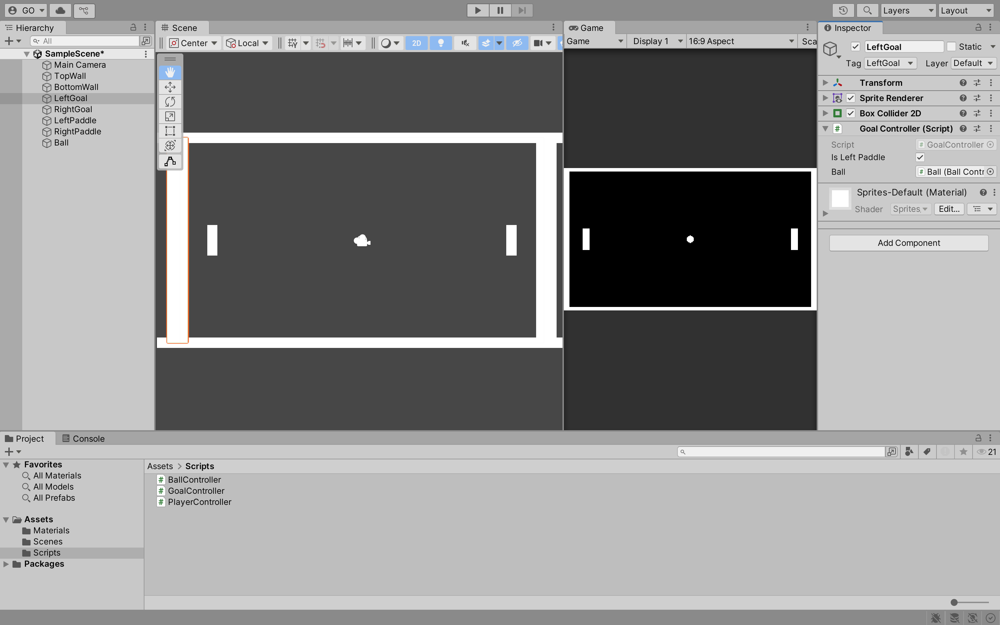
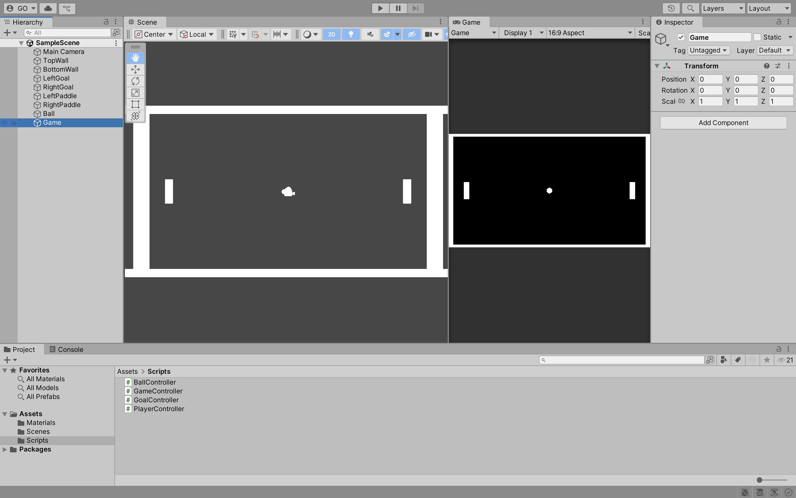

## Week 02

## Previous Class

Link to the previous class: [Week 01](https://github.com/otago-polytechnic-bit-courses/ID623001-introductory-game-development/blob/main-s1-25/lecture-notes/01-github-unity-main-camera-sprite-rigidbody-2d-collider-script.md)

---

## Pong Game

In this module, you will continue to develop **Pong** using Unity.

---

### Physics Material 2D

**Physics Material 2D** is used to adjust the friction and bounciness of colliders. 

In the **Assets** folder, create a new folder called **Materials**. Double-click the **Materials** folder to open it. Right-click in the **Materials** folder and select **Create > 2D > Physics Material 2D**. Name the material `BallPhysicsMaterial`. 


In the **Inspector** window, change the **Friction** to `0` and the **Bounciness** to `1`. Drag and drop the `BallPhysicsMaterial` onto the `Ball` **Sprite** in the **Hierarchy** window.


Click on the `Ball` **Sprite** in the **Hierarchy** window. In the **Inspector** window, change the **Material** to `BallPhysicsMaterial`.


Click the **Play** button to test the game. The ball should now bounce off the paddles, walls and goals. You will notice a minor issue where the paddles and ball rotate when they collide. 

To fix this, click on the `Ball` **Sprite** in the **Hierarchy** window. In the **Inspector** window, check the **Rigidbody 2D > Constraints > Freeze Rotation** box for the **Z** axis. Repeat this process for the `LeftPaddle` and `RightPaddle` **Sprite**.


Click the **Play** button to test the game. The paddles and ball should no longer rotate when they collide. Again, you will notice a minor issue where the paddles move on the **X** axis when they collide with the ball.

Click on the `LeftPaddle` **Sprite** in the **Hierarchy** window. In the **Inspector** window, check the **Rigidbody 2D > Constraints > Freeze Position** box for the **X** axis. Repeat this process for the `RightPaddle` **Sprite**.


---

### Trigger

A **Trigger** is a collider that does not physically interact with other colliders. It is used to detect when other colliders enter or exit its area. For example, you can use a trigger to detect when the ball collides with the left or right goals.

Click on the `LeftGoal` and `RightGoal` **Sprites** in the **Hierarchy** window. In the **Inspector** window, check the **Box Collider 2D > Is Trigger** box.


---

### Tag

A **Tag** is a label that you can assign to **GameObjects**. You can use tags to identify **GameObjects** in your scripts. For example, you can use tags to identify the ball, paddles, walls, and goals.

Click on the `Ball` **Sprite** in the **Hierarchy** window. In the **Inspector** window, click the **Tag** dropdown menu and select **Add Tag**. Click the **+** button to add a new tag. Name the tag `Ball` and click **Save**. Repeat this process for the `TopWall`, `BottomWall`, `LeftGoal`, `RightGoal`, `LeftPaddle` and `RightPaddle` **Sprites**.


Click on the `Ball` **Sprite** in the **Hierarchy** window. In the **Inspector** window, click the **Tag** dropdown menu and select the `Ball` tag. Repeat this process for the `TopWall`, `BottomWall`, `LeftGoal`, `RightGoal`, `LeftPaddle` and `RightPaddle` **Sprites**.


---

### Reset Ball

In this section, you will create a script that resets the ball when it enters the left or right goals. In the **Scripts** folder, create a new script called `GoalController`. 

Add the following code to the `GoalController` script:

```csharp
using System.Collections;
using System.Collections.Generic;
using UnityEngine;

public class GoalController : MonoBehaviour
{
    [SerializeField] private bool isLeftPaddle;
    [SerializeField] private BallController ball;

    private void OnTriggerEnter2D(Collider2D collision)
    {
        if (collision.gameObject.CompareTag("Ball"))
        {
            if (!isLeftPaddle)
            {
                // Left paddle scored
            }
            else
            {
                // Right paddle scored
            }

            ball.Reset();
        }
    }
}
```

What is happening in the code above?

- The `OnTriggerEnter2D` method is called when the `Ball` **Sprite** enters the `LeftGoal` or `RightGoal` **Sprite** collider
- If the `Ball` **Sprite** enters the `LeftGoal` or `RightGoal` **Sprite** collider, the `Reset` method in the `BallController` script is called

Drag and drop the `GoalController` script onto the `LeftGoal` and `RightGoal` **Sprites** in the **Hierarchy** window. Click on the `LeftGoal` **Sprite** in the **Hierarchy** window. Change the `isLeftPaddle` value to `true` and the `ball` value to the `Ball` **Sprite**. Repeat this process for the `RightGoal` **Sprite** but change the `isLeftPaddle` value to `false`.



---

### Game Manager

In this section, you will create a script that keeps track of the left and right paddle scores. In the **Scripts** folder, create a new script called `GameController`. 

Add the following code to the `GameController` script:

```csharp
using System.Collections;
using System.Collections.Generic;
using UnityEngine;

public class GameController : MonoBehaviour
{
    private int leftPaddleScore = 0;
    private int rightPaddleScore = 0;

    public void LeftPaddleScored()
    {
        leftPaddleScore++;
        Debug.Log($"Left Paddle Scored: {leftPaddleScore}");
    }

    public void RightPaddleScored()
    {
        rightPaddleScore++;
        Debug.Log($"Right Paddle Scored: {rightPaddleScore}");
    }
}
```

> **Note:** The `Debug.Log` method is used to display messages in the **Console** window. You can use this method to debug your scripts. Please remove the `Debug.Log` method calls when you have finished testing your scripts.

In the **Hierarchy** window, create an empty **GameObject**, i.e., **Create Empty** called `Game`. Drag and drop the `GameController` script onto the `Game` **GameObject**. Also, reset the `Game` **GameObject**'s **Transform** values to `0`.



Click on the `LeftGoal` **Sprite** in the **Hierarchy** window. Change the `game` value to the `Game` **GameObject**. Repeat this process for the `RightGoal` **Sprite**.

**Tasks:**

1. In the `GoalController` script, add a reference to the `GameController` script
2. In the `GoalController` script, call the `LeftPaddleScored` method when the `Ball` **Sprite** enters the `LeftGoal` **Sprite** collider
3. In the `GoalController` script, call the `RightPaddleScored` method when the `Ball` **Sprite** enters the `RightGoal` **Sprite** collider

Click the **Play** button to test the game. The left and right paddle scores should be displayed in the **Console** window when the ball enters the left or right goals.

---

### Canvas

---

### Text

---

## Formative Assessment

Learning to use AI tools is an important skill. While AI tools are powerful, you **must** be aware of the following:

- If you provide an AI tool with a prompt that is not refined enough, it may generate a not-so-useful response
- Do not trust the AI tool's responses blindly. You **must** still use your judgement and may need to do additional research to determine if the response is correct
- Acknowledge what AI tool you have used. In the assessment's repository **README.md** file, please include what prompt(s) you provided to the AI tool and how you used the response(s) to help you with your work

---

### Submission

Create a new pull request and assign **grayson-orr** to review your practical submission. Please do not merge your own pull request.

---

## Next Class

Link to the next class: [Week 03]()