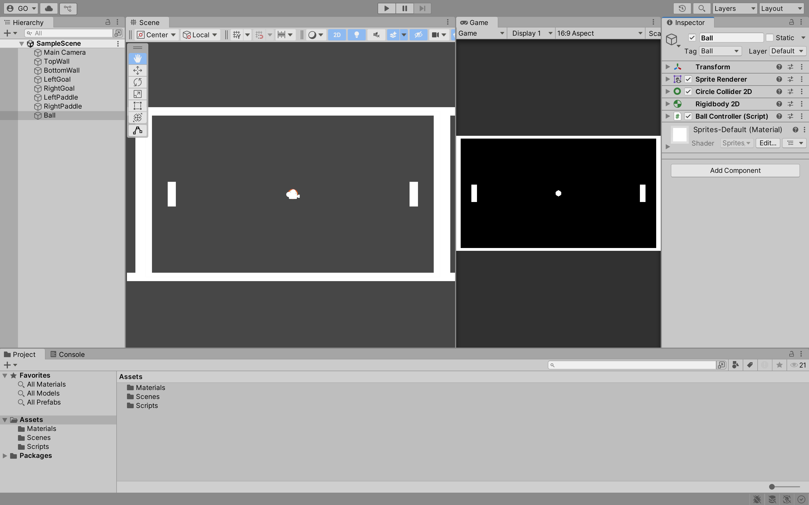
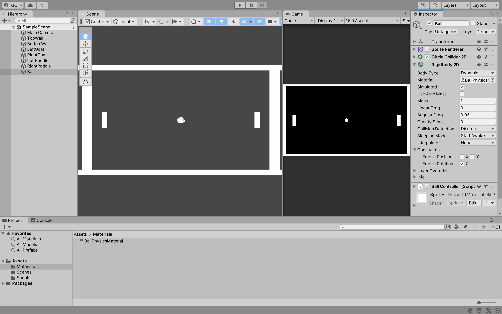
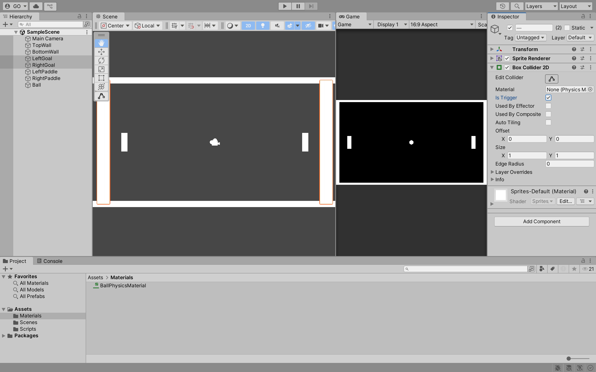
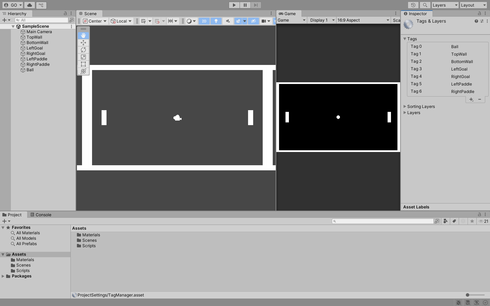

## Week 02

## Previous Class

Link to the previous class: [Week 01](https://github.com/otago-polytechnic-bit-courses/ID623001-introductory-game-development/blob/main-s1-25/lecture-notes/01-github-unity-main-camera-sprite-rigidbody-2d-collider-script.md)

---

## Pong Game

In this module, you will continue to develop **Pong** using Unity.

---

### Physics Material 2D

**Physics Material 2D** is used to adjust the friction and bounciness of colliders. 

In the **Assets** folder, create a new folder called **Materials**. Double-click the **Materials** folder to open it. Right-click in the **Materials** folder and select **Create > 2D > Physics Material 2D**. Name the material `BallPhysicsMaterial`. 

In the **Inspector** window, change the **Friction** to `0` and the **Bounciness** to `1`. Drag and drop the `BallPhysicsMaterial` onto the `Ball` **Sprite** in the **Hierarchy** window.

Click on the `Ball` **Sprite** in the **Hierarchy** window. In the **Inspector** window, change the **Material** to `BallPhysicsMaterial`.

Click the **Play** button to test the game. The ball should now bounce off the paddles, walls and goals. You will notice a minor issue where the paddles and ball rotate when they collide. 

To fix this, click on the `Ball` **Sprite** in the **Hierarchy** window. In the **Inspector** window, check the **Rigidbody 2D > Constraints > Freeze Rotation** box for the **Z** axis. Repeat this process for the `LeftPaddle` and `RightPaddle` **Sprite**.

Click the **Play** button to test the game. The paddles and ball should no longer rotate when they collide. Again, you will notice a minor issue where the paddles move on the **X** axis when they collide with the ball.

Click on the `LeftPaddle` **Sprite** in the **Hierarchy** window. In the **Inspector** window, check the **Rigidbody 2D > Constraints > Freeze Position** box for the **X** axis. Repeat this process for the `RightPaddle` **Sprite**.

---

### Trigger

A **Trigger** is a collider that does not physically interact with other colliders. It is used to detect when other colliders enter or exit its area. For example, you can use a trigger to detect when the ball collides with the left or right goals.

Click on the `LeftGoal` and `RightGoal` **Sprites** in the **Hierarchy** window. In the **Inspector** window, check the **Box Collider 2D > Is Trigger** box.

---

### Tag

A **Tag** is a label that you can assign to **GameObjects**. You can use tags to identify **GameObjects** in your scripts. For example, you can use tags to identify the ball, paddles, walls, and goals.

Click on the `Ball` **Sprite** in the **Hierarchy** window. In the **Inspector** window, click the **Tag** dropdown menu and select **Add Tag**. Click the **+** button to add a new tag. Name the tag `Ball` and click **Save**. Repeat this process for the `TopWall`, `BottomWall`, `LeftGoal`, `RightGoal`, `LeftPaddle` and `RightPaddle` **Sprites**.

Click on the `Ball` **Sprite** in the **Hierarchy** window. In the **Inspector** window, click the **Tag** dropdown menu and select the `Ball` tag. Repeat this process for the `TopWall`, `BottomWall`, `LeftGoal`, `RightGoal`, `LeftPaddle` and `RightPaddle` **Sprites**.

---

### Reset Ball

---

### Game Manager

---

### Canvas

---

### Text

## Formative Assessment

Learning to use AI tools is an important skill. While AI tools are powerful, you **must** be aware of the following:

- If you provide an AI tool with a prompt that is not refined enough, it may generate a not-so-useful response
- Do not trust the AI tool's responses blindly. You **must** still use your judgement and may need to do additional research to determine if the response is correct
- Acknowledge what AI tool you have used. In the assessment's repository **README.md** file, please include what prompt(s) you provided to the AI tool and how you used the response(s) to help you with your work

---

### Submission

Create a new pull request and assign **grayson-orr** to review your practical submission. Please do not merge your own pull request.

---

## Next Class

Link to the next class: [Week 03]()