## Week 02

## Previous Class

Link to the previous class: [Week 01](https://github.com/otago-polytechnic-bit-courses/ID623001-introductory-game-development/blob/main-s1-25/lecture-notes/01-github-unity-main-camera-sprite-rigidbody-2d-collider-script.md)

---

## Pong Game

In this module, you will continue to develop **Pong** using **Unity**.

---

## Physics Material 2D

**Physics Material 2D** is used to adjust the friction and bounciness of colliders. 

In the **Assets** folder, create a new folder called **Materials**. Double-click the **Materials** folder to open it. Right-click in the **Materials** folder and select **Create > 2D > Physics Material 2D**. Name the material `BallPhysicsMaterial`. 

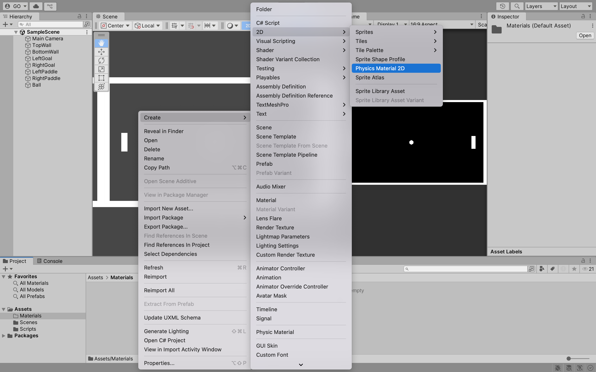

In the **Inspector**, change the **Friction** to `0` and the **Bounciness** to `1`. Drag and drop the `BallPhysicsMaterial` onto the `Ball` **Sprite** in the **Hierarchy**.

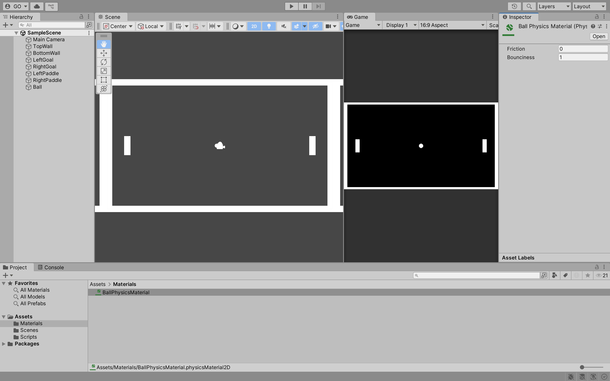

Click on the `Ball` **Sprite** in the **Hierarchy**. In the **Inspector**, change the **Material** to `BallPhysicsMaterial`.

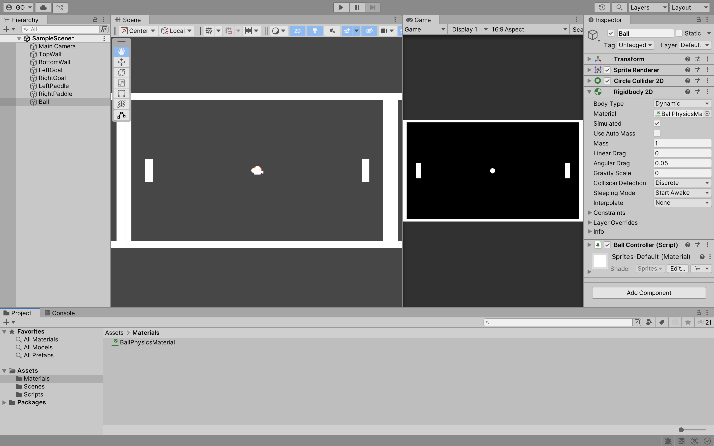

Click the **Play** button to test the game. The ball should now bounce off the paddles, walls and goals. You will notice a minor issue where the paddles and ball rotate when they collide. 

To fix this, click on the `Ball` **Sprite** in the **Hierarchy**. In the **Inspector**, check the **Rigidbody 2D > Constraints > Freeze Rotation** box for the **Z** axis. Repeat this process for the `LeftPaddle` and `RightPaddle` **Sprite**.


Click the **Play** button to test the game. The paddles and ball should no longer rotate when they collide. Again, you will notice a minor issue where the paddles move on the **X** axis when they collide with the ball.

Click on the `LeftPaddle` **Sprite** in the **Hierarchy**. In the **Inspector**, check the **Rigidbody 2D > Constraints > Freeze Position** box for the **X** axis. Repeat this process for the `RightPaddle` **Sprite**.

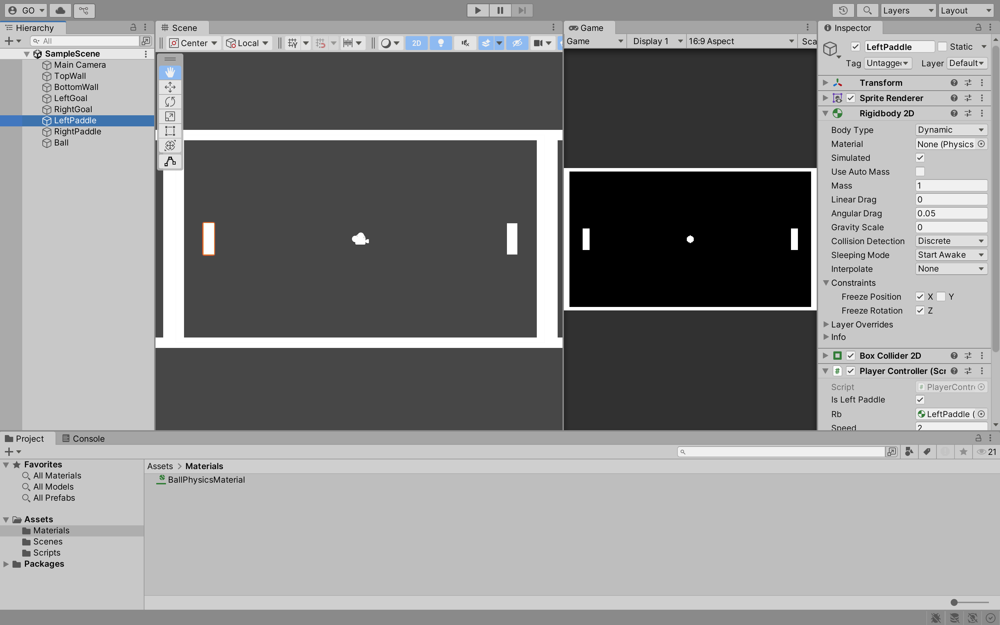

---

## Trigger

A **Trigger** is a collider that does not physically interact with other colliders. It is used to detect when other colliders enter or exit its area. For example, you can use a trigger to detect when the ball collides with the left or right goals.

Click on the `LeftGoal` and `RightGoal` **Sprites** in the **Hierarchy**. In the **Inspector**, check the **Box Collider 2D > Is Trigger** box.


---

## Tag

A **Tag** is a label that you can assign to **GameObjects**. You can use tags to identify **GameObjects** in your scripts. For example, you can use tags to identify the ball, paddles, walls and goals.

Click on the `Ball` **Sprite** in the **Hierarchy**. In the **Inspector**, click the **Tag** dropdown menu and select **Add Tag**. Click the **+** button to add a new tag. Name the tag `Ball` and click **Save**. Repeat this process for the `TopWall`, `BottomWall`, `LeftGoal`, `RightGoal`, `LeftPaddle` and `RightPaddle` **Sprites**.


Click on the `Ball` **Sprite** in the **Hierarchy**. In the **Inspector**, click the **Tag** dropdown menu and select the `Ball` tag. Repeat this process for the `TopWall`, `BottomWall`, `LeftGoal`, `RightGoal`, `LeftPaddle` and `RightPaddle` **Sprites**.


---

## Reset Ball

In this section, you will create a script that resets the ball when it enters the left or right goals. In the **Scripts** folder, create a new script called `GoalController`. 

Add the following code to the `GoalController` script:

```csharp
using System.Collections;
using System.Collections.Generic;
using UnityEngine;

public class GoalController : MonoBehaviour
{
    [SerializeField] private bool isLeftPaddle;
    [SerializeField] private BallController ball;

    private void OnTriggerEnter2D(Collider2D collision)
    {
        if (collision.gameObject.CompareTag("Ball"))
        {
            if (!isLeftPaddle)
            {
                // Left paddle scored
            }
            else
            {
                // Right paddle scored
            }

            ball.Reset();
        }
    }
}
```

What is happening in the code above?

- The `OnTriggerEnter2D` method is called when the `Ball` **Sprite** enters the `LeftGoal` or `RightGoal` **Sprite** collider
- If the `Ball` **Sprite** enters the `LeftGoal` or `RightGoal` **Sprite** collider, the `Reset` method in the `BallController` script is called

Drag and drop the `GoalController` script onto the `LeftGoal` and `RightGoal` **Sprites** in the **Hierarchy**. Click on the `LeftGoal` **Sprite** in the **Hierarchy**. Change the `isLeftPaddle` value to `true` and the `ball` value to the `Ball` **Sprite**. Repeat this process for the `RightGoal` **Sprite** but change the `isLeftPaddle` value to `false`.


---

## Game Manager

In this section, you will create a script that keeps track of the left and right paddle scores. In the **Scripts** folder, create a new script called `GameController`. 

Add the following code to the `GameController` script:

```csharp
using System.Collections;
using System.Collections.Generic;
using UnityEngine;

public class GameController : MonoBehaviour
{
    private int leftPaddleScore = 0;
    private int rightPaddleScore = 0;

    public void LeftPaddleScored()
    {
        leftPaddleScore++;
        Debug.Log($"Left Paddle Scored: {leftPaddleScore}");
    }

    public void RightPaddleScored()
    {
        rightPaddleScore++;
        Debug.Log($"Right Paddle Scored: {rightPaddleScore}");
    }
}
```

> **Note:** The `Debug.Log` method is used to display messages in the **Console**. You can use this method to debug your scripts. Please remove the `Debug.Log` method calls when you have finished testing your scripts.

In the **Hierarchy**, create an empty **GameObject**, i.e., **Create Empty** called `Game`. Drag and drop the `GameController` script onto the `Game` **GameObject**. Also, reset the `Game` **GameObject**'s **Transform** values to `0`.


**Tasks:**

1. In the `GoalController` script, add a reference to the `GameController` script
2. Click on the `LeftGoal` **Sprite** in the **Hierarchy**. Change the `game` value to the `Game` **GameObject**. Repeat this process for the `RightGoal` **Sprite**.

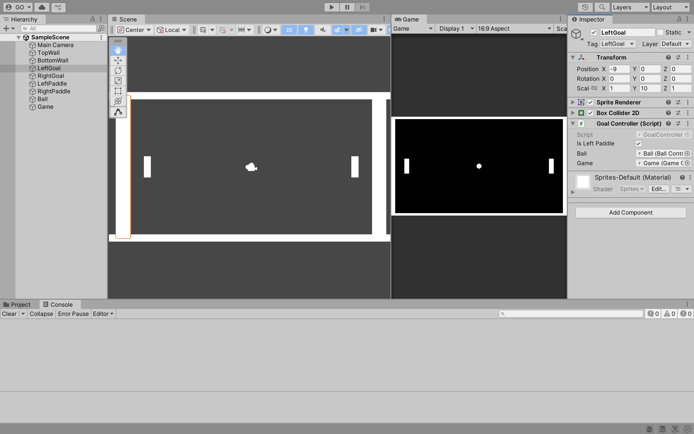

3. In the `GoalController` script, call the `LeftPaddleScored` method when the `Ball` **Sprite** enters the `LeftGoal` **Sprite** collider
4. In the `GoalController` script, call the `RightPaddleScored` method when the `Ball` **Sprite** enters the `RightGoal` **Sprite** collider

Click the **Play** button to test the game. The left and right paddle scores should be displayed in the **Console** when the ball enters the left or right goals.

---

## Canvas

The **Canvas** is a **GameObject** that holds all UI elements. You will use the **Canvas** to display the left and right paddle scores.

In the **Hierarchy**, right-click and select **UI > Canvas**. This is also going to create an **EventSystem** **GameObject**. 

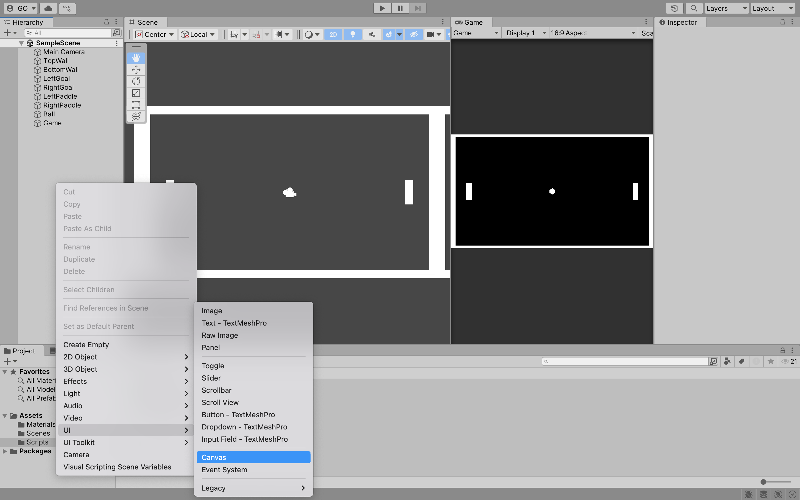

Right-click on the **Canvas** **GameObject** and select **UI > Text - Text Mesh Pro**. 

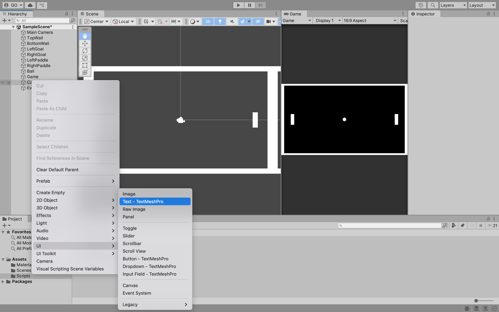

You will need to install **Text Mesh Pro** if you have not already done so. 

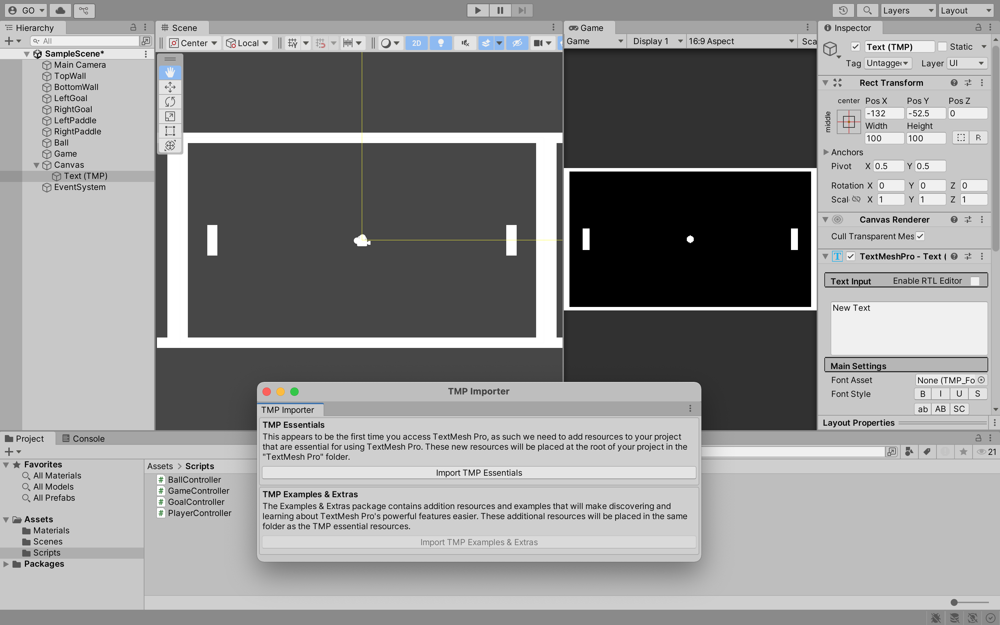

You will notice the **Text - Text Mesh Pro** **GameObject** is created as a child of the **Canvas** **GameObject**.

> **Note:** The **EventSystem** **GameObject** is used to manage input from the keyboard, mouse and touch. You do not need to modify the **EventSystem** **GameObject**.

Zoom out in the **Scene** to see the **Canvas** **GameObject** and **Text - Text Mesh Pro** **GameObject**. 

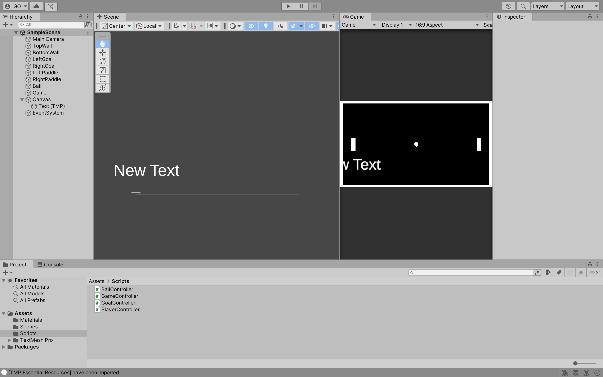

What happens when you resize the **Scene**? The **Text - Text Mesh Pro** **GameObject** will resize to fit the **Scene**.

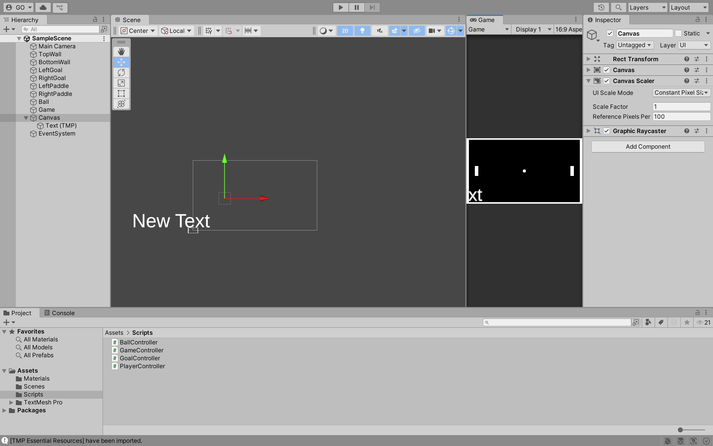

Click on the **Canvas** **GameObject** in the **Hierarchy**. In the **Inspector**, change the **Canvas Scaler > UI Scale Mode** to `Scale With Screen Size` and the **Canvas Scaler > Reference Resolution** to `1920 x 1080`.

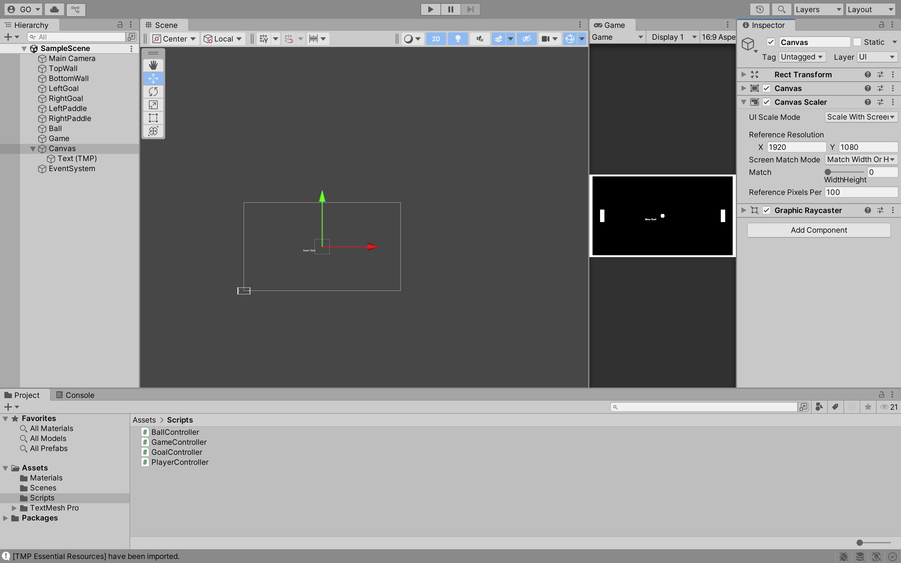

**Tasks:**

1. Rename the **Text - Text Mesh Pro** **GameObject**'s name to `LeftPaddleScoreText`. 
2. Click on the **Text - Text Mesh Pro** **GameObject** in the **Hierarchy** and change the **Font Size** to `85`.
3. Move the **Text - Text Mesh Pro** **GameObject** to an appropriate position on the **Canvas** **GameObject**. 
4. Change the **Text - Text Mesh Pro** **GameObject**'s **Text** value to `0`.
5. Repeat the above steps for the right paddle score.

After completing the above tasks, your **Canvas** **GameObject** should look similar to the image below.

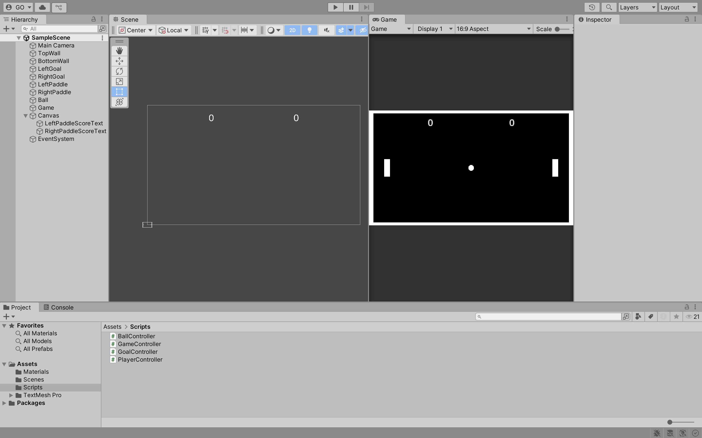

You are now ready to update the left and right paddle scores in the **Canvas** **GameObject**.

In the `GameController` script, update the `LeftPaddleScored` and `RightPaddleScored` methods to update the left and right paddle scores in the **Canvas** **GameObject**.

```csharp
// Omitted for brevity

using TMPro;

public class GameController : MonoBehaviour
{
    // Omitted for brevity

    [SerializeField] TextMeshProUGUI leftPaddleScoreText;
    [SerializeField] TextMeshProUGUI rightPaddleScoreText;

    public void LeftPaddleScored()
    {
        // Omitted for brevity
        leftPaddleScoreText.text = leftPaddleScore.ToString();
    }

    public void RightPaddleScored()
    {
        // Omitted for brevity
        rightPaddleScoreText.text = rightPaddleScore.ToString();
    }
}
```

In the **Inspector**, drag and drop the `LeftPaddleScoreText` and `RightPaddleScoreText` **Text - Text Mesh Pro** **GameObjects** onto the `GameController` script's `leftPaddleScoreText` and `rightPaddleScoreText` fields.

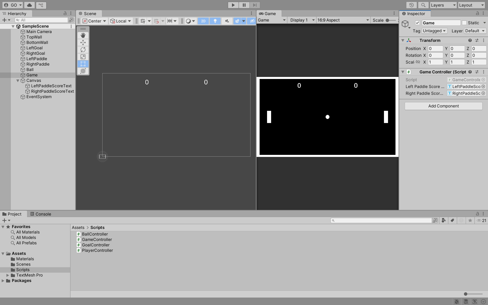

Click the **Play** button to test the game. The left and right paddle scores should be displayed in the **Canvas** **GameObject**.

---

## Exercises

Learning to use AI tools is an important skill. While AI tools are powerful, you **must** be aware of the following:

- If you provide an AI tool with a prompt that is not refined enough, it may generate a not-so-useful response
- Do not trust the AI tool's responses blindly. You **must** still use your judgement and may need to do additional research to determine if the response is correct
- Acknowledge what AI tool you have used. In the assessment's repository **README.md** file, please include what prompt(s) you provided to the AI tool and how you used the response(s) to help you with your work

---

### Task 1

Create a center line using a **Sprite**. The center line should be a thin line that runs vertically down the center of the game.

---

### Task 2 (Independent Research)

When a new game starts, randomise the colour of the ball, paddles, walls, goals and center line. The colour of the walls, goals and center line should be the same.

> **Hint on how to solve this task:** To access a **Sprite**'s **Color** property, you will need to access the **SpriteRenderer** component. 

```csharp
private SpriteRenderer ballRenderer; 

void Start()
{
    ballRenderer = GetComponent<SpriteRenderer>();
    ballRenderer.color = new Color(Random.value, Random.value, Random.value);
}
```

---

### Task 3

When a player presses the **P** key, pause the game. When the game is paused, display **Paused** in the center of the game. When the player presses the **P** key again, unpause the game.

> **Hint on how to solve this task:** To pause the game, you can set the **Time.timeScale** property to `0f`. To unpause the game, you can set the **Time.timeScale** property to `1f`.

---

### Task 4

When a player scores 10 points, stop the game, hide the ball, paddles and center line and display either **Left Paddle Wins! Press R to Restart** or **Right Paddle Wins! Press R to Restart** in the center of the game.

---

### Task 5 (Independent Research)

When a player presses the **R** key, restart the game. 

> **Hint on how to solve this task:** To restart the game, you can reload the current scene using the **SceneManager.LoadScene** method.

```csharp
SceneManager.LoadScene(SceneManager.GetActiveScene().buildIndex);
```

---

### Expected Outputs

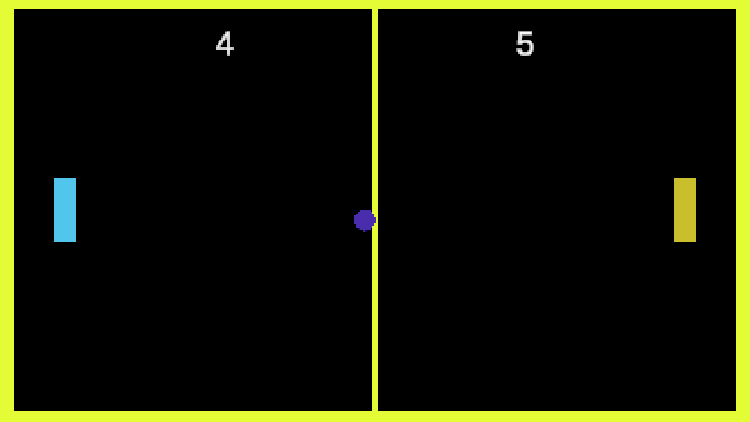

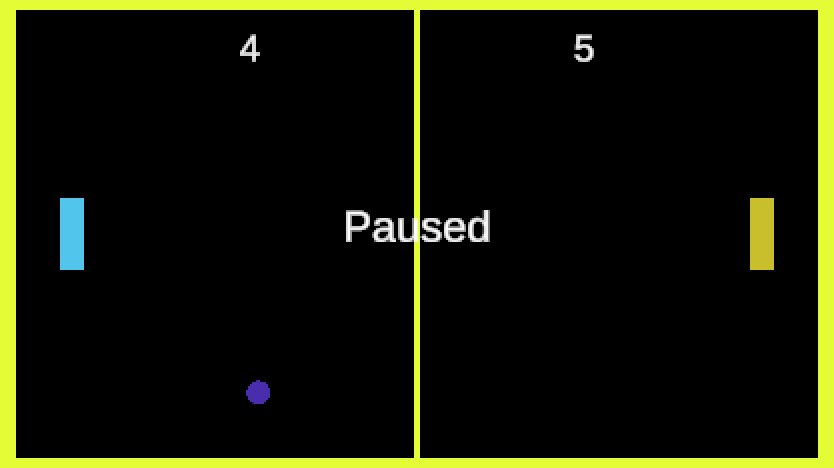

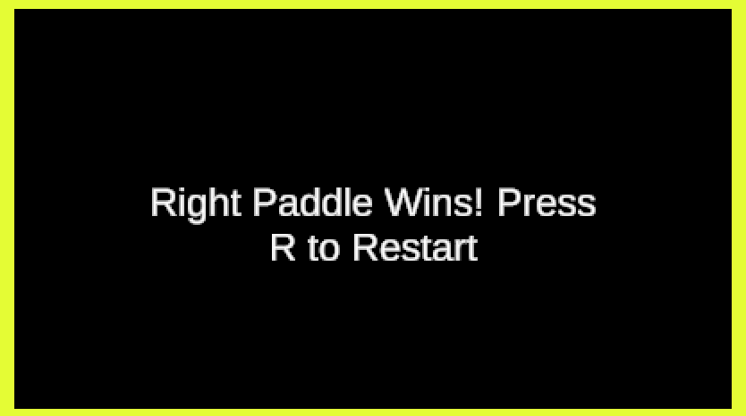

---

## Next Class

Link to the next class: [Week 03](https://github.com/otago-polytechnic-bit-courses/ID623001-introductory-game-development/blob/main-s1-25/lecture-notes/03-multiple-inputs-fixed-update-prefabs-grid-snap-panel.md)
