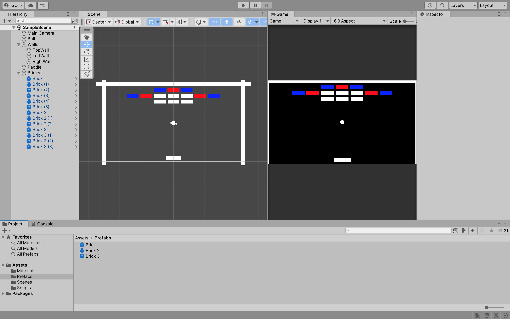
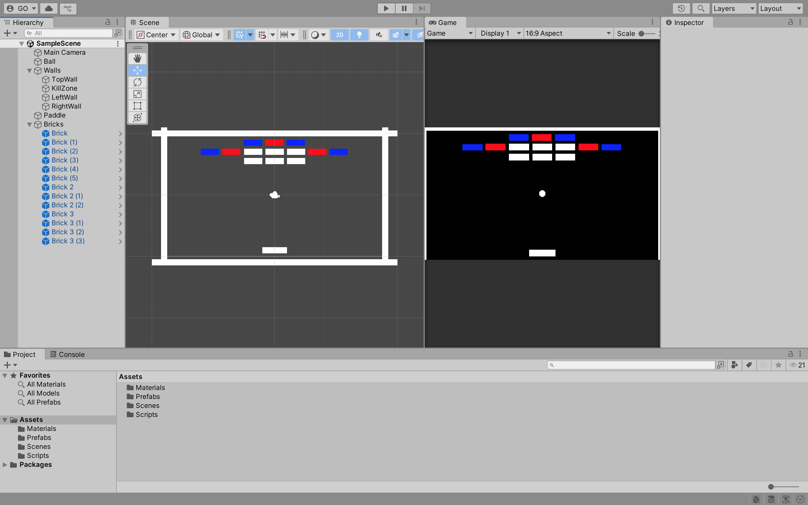
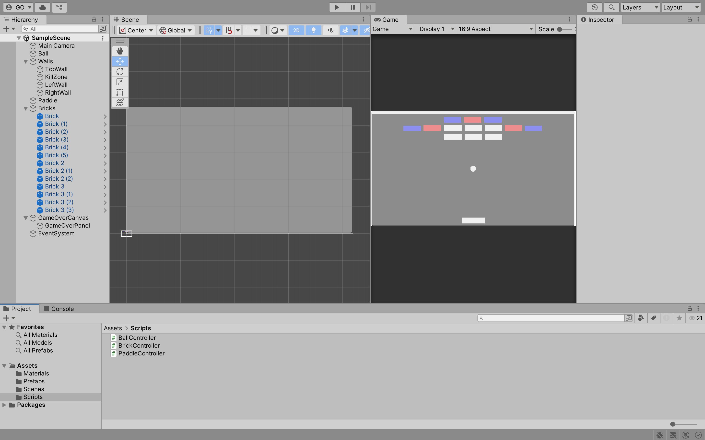
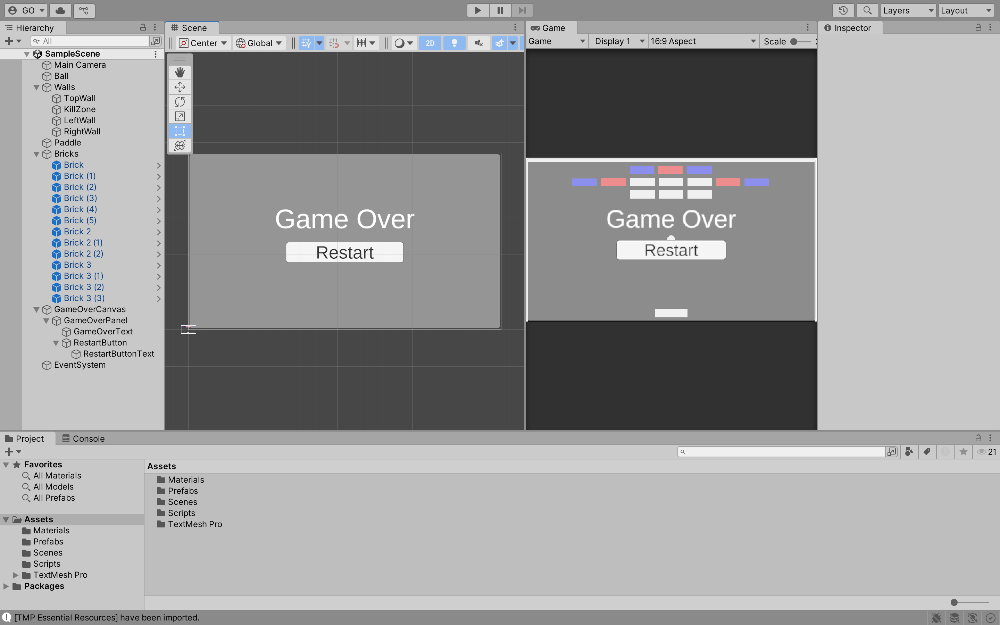
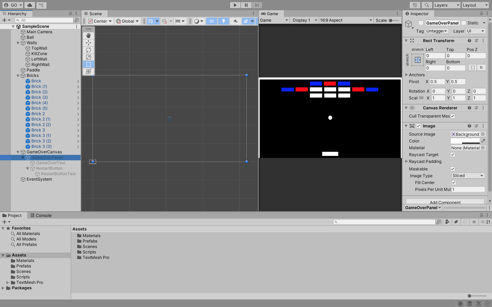
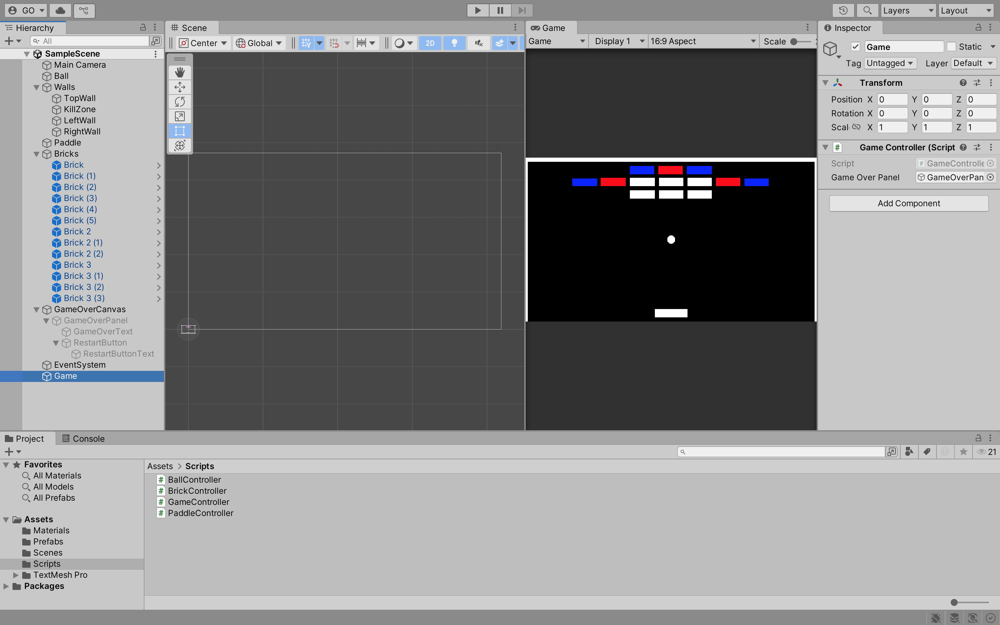
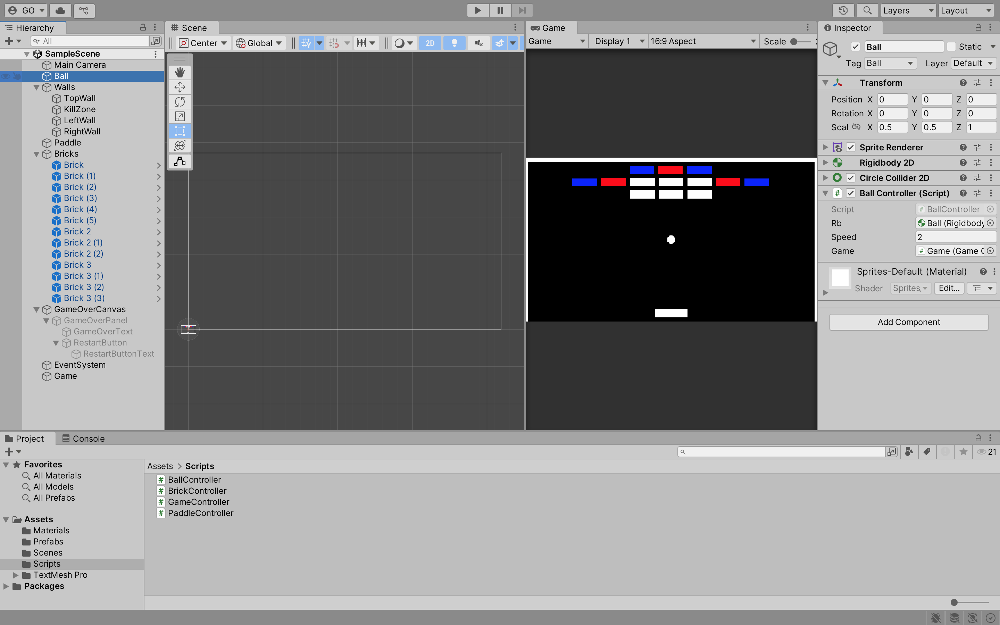

## Week 03

## Previous Class

Link to the previous class: [Week 02](https://github.com/otago-polytechnic-bit-courses/ID623001-introductory-game-development/blob/main-s1-25/lecture-notes/02-physic-material-2d-tag-canvas-text.md)

---

## Breakout Game

In this module, you will develop **Breakout** using **Unity**. Create a new **Unity** project using the **2D (Built-In Render Pipeline)** template. Name your project `breakout` and select a location to save your project. Click on the **Create project** button.

---

## Sprites

Setup your scene with `Ball`, `TopWall`, `LeftWall`, `RightWall` and `Paddle` sprites.

> **Note:** You can organise your **GameObjects** in the **Hierarchy**. For example, you can create an empty **GameObject** and name it `Walls` and then drag all the wall **GameObjects** under it.


**Task:**

1. Add a **Box Collider 2D** component to the `TopWall`, `LeftWall` and `RightWall` sprites.

---

## Paddle

Add a **Rigidbody 2D** and a **Box Collider 2D** component to the `Paddle` sprite.

**Tasks:**

1. Set the `Gravity Scale` to `0`.
2. Prevent the `Paddle` sprite from rotating.
3. Prevent the `Paddle` sprite from moving in the Y-axis.

Create a new script called `PaddleController` and attach it to the `Paddle` sprite.

```csharp
using System.Collections;
using System.Collections.Generic;
using UnityEngine;

public class PaddleController : MonoBehaviour
{
    [SerializeField] private Rigidbody2D rb;
    [SerializeField] private float speed = 10f;

    private float direction;

    void Update()
    {
        if (Input.GetKey(KeyCode.RightArrow))
        {
            direction = 1f;
        }
        else if (Input.GetKey(KeyCode.LeftArrow))
        {
            direction = -1f;
        }
        else
        {
            direction = 0f;
        }

        rb.linearVelocity = new Vector2(direction, 0f) * speed;
    }
}
```

Click the **Play** button to test the game. You should be able to move the `Paddle` sprite left and right.

---

## Multiple Inputs

Currently, the `Paddle` sprite can only be moved using the arrow keys. Let us add support for the `A` and `D` keys. Update the `PaddleController` script as follows:

```csharp
// Omitted for brevity

public class PaddleController : MonoBehaviour
{
    // Omitted for brevity

    void Update()
    {
        if (Input.GetKey(KeyCode.RightArrow) || Input.GetKey(KeyCode.D))
        {
            direction = 1f;
        }
        else if (Input.GetKey(KeyCode.LeftArrow) || Input.GetKey(KeyCode.A))
        {
            direction = -1f;
        }

        // Omitted for brevity
    }
}
```

Click the **Play** button to test the game. You should be able to move the `Paddle` sprite left and right using the arrow keys and the `A` and `D` keys.

---

## Fixed Update

The `Update` method is called once per frame. If you are using physics in your game, you should use the `FixedUpdate` method instead. The `FixedUpdate` method is called at a fixed interval and is independent of the frame rate.

Update the `PaddleController` script to use the `FixedUpdate` method:

```csharp
// Omitted for brevity

public class PaddleController : MonoBehaviour
{
    // Omitted for brevity

    void FixedUpdate()
    {
        rb.linearVelocity = new Vector2(direction, 0f) * speed;
    }

    void Update()
    {
        if (Input.GetKey(KeyCode.RightArrow) || Input.GetKey(KeyCode.D))
        {
            direction = 1f;
        }
        else if (Input.GetKey(KeyCode.LeftArrow) || Input.GetKey(KeyCode.A))
        {
            direction = -1f;
        }
        else
        {
            direction = 0f;
        }
    }
}
```

**Task:**

1. In your **Pong** game, update the `PlayerController` script to use the `FixedUpdate` method.

---

## Ball

Add a **Rigidbody 2D** and a **Circle Collider 2D** component to the `Ball` sprite.

**Tasks:**

1. Set the `Gravity Scale` to `0`.
2. Prevent the `Ball` sprite from rotating.
3. Add a new **Physics Material 2D** called `BounceMaterial` and set the `Bounciness` to `0.987`.
4. In the **Rigidbody 2D** component, set the `Material` to `BallPhysicsMaterial`.

Create a new script called `BallController` and attach it to the `Ball` sprite.

```csharp
using System.Collections;
using System.Collections.Generic;
using UnityEngine;

public class BallController : MonoBehaviour
{
    [SerializeField] private Rigidbody2D rb;
    [SerializeField] private float speed = 5f;

    Vector2 startPos;

    void Start()
    {
        startPos = transform.position;

        Reset();
    }

    void FixedUpdate()
    {
        rb.linearVelocity = rb.linearVelocity.normalized * speed;
    }

    public void Reset()
    {
        transform.position = Vector3.zero;

        float x = 0;

        int randNum = Random.Range(0, 2);

        if (randNum == 0)
        {
            x = 1f;
        }
        else if (randNum == 1)
        {
            x = -1f;
        }

        rb.linearVelocity = new Vector2(x, 1f) * speed;
    }
}
```

---

## Prefabs

**Prefabs** are pre-configured **GameObjects** that you can reuse in your game.

Create a new sprite called `Brick`. In the **Assets** folder, create a new folder called `Prefabs`.


Drag the `Brick` sprite into the `Prefabs` folder to create a **Prefab**.


---

## Grid Snap

**Grid Snap** allows you to align **GameObjects** to a grid. This is useful when you want to align **GameObjects** in your scene.

In **Toggle Grid Snapping**, set the **Grid Size** to `0.5` and check **Snap To Grid** to enable **Grid Snap**.

**Tasks:**

1. Add six `Brick` **Prefabs** to your scene.

Your scene should look like this:


2. Create a **GameObject** called `Bricks` and drag all the `Brick` **GameObjects** under it.


---

## Destroy Bricks

You are going to use the `OnCollisionEnter2D` method to detect collisions between the `Ball` and the `Brick` **GameObjects**.

**Tasks:**

1. Add a **Box Collider 2D** component to the `Brick` **Prefab**.

2. In the `Ball` sprite, create a new **Tag** called `Ball`. Set the **Tag** to `Ball`.

3. Create a new script called `BrickController` and attach it to the `Brick` **Prefab**.

```csharp
using System.Collections;
using System.Collections.Generic;
using UnityEngine;

public class BrickController : MonoBehaviour
{
    private void OnCollisionEnter2D(Collision2D collision)
    {
        if (collision.gameObject.CompareTag("Ball"))
        {
            Destroy(gameObject);
        }
    }
}
```

Click the **Play** button to test the game. When the `Ball` sprite collides with the `Brick` **GameObjects**, the `Brick` **GameObject** should be destroyed. 

When a `Brick` **GameObject** is destroyed, what do you notice about the **Hierarchy**?

---

## Creating More Bricks

**Tasks:**

1. Create two more `Brick` **Prefabs** called `Brick2` and `Brick3`.



2. For `Brick2`, set the **Color** to `Red` and for `Brick3`, set the **Color** to `Blue`.
3. Add some `Brick2` and `Brick3` **Prefabs** to your scene.
4. In the `BrickController` script, add a new `SerializedField` called `health` and set it to `1`.
5. Set the `health` of `Brick2` to `2` and the `health` of `Brick3` to `3`.
6. In the `BrickController` script, update the `OnCollisionEnter2D` method to reduce the `health` of the `Brick` **GameObject**. If the `health` is less than or equal to `0`, destroy the `Brick` **GameObject**. You also need to change the **Color** of the `Brick` **GameObject** based on the `health`. For example, if the `health` is `1`, set the **Color** to `White`, if the `health` is `2`, set the **Color** to `Red` and so forth.

---

## Kill Zone

A **Kill Zone** is an area in your game where the player loses a life. In **Breakout**, the **Kill Zone** is the bottom of the screen.

**Tasks:**

1. Copy the `TopWall` **GameObject** and rename it to `KillZone`.
2. Set the `KillZone` **GameObject** to the bottom of the screen.



3. In the `Box Collider 2D` component, set the `Is Trigger` to `true`.
4. Create a new **Tag** called `KillZone`. Set the **Tag** to `KillZone`.
5. In the `BallController` script, add a new `OnTriggerEnter2D` method to detect collisions between the `Ball` and the `KillZone` **GameObject**. 

```csharp
private void OnTriggerEnter2D(Collider2D collision)
{
    if (collision.gameObject.CompareTag("KillZone"))
    {
        Debug.Log("Ball hit the Kill Zone");
    }
}
```

Click the **Play** button to test the game. When the `Ball` sprite collides with the `KillZone` **GameObject**, you should see the message `Ball hit the Kill Zone` in the **Console**.

---

## Panel

You are going to create a **Panel** that will display when the game is over.

**Tasks:**

1. Create a new **UI** **Canvas** called `GameOverCanvas`.
2. Create a new **UI** **Panel** called `GameOverPanel`.



3. In the `GameOverPanel`, add a **Text - Text Mesh Pro** **GameObject** called `GameOverText` and a **Button - Text Mesh Pro** **GameObject** called `RestartButton`. Set the **Text** of the `GameOverText` to `Game Over` and the **Text** of the `RestartButton` to `Restart`.



4. Disable the `GameOverPanel` **GameObject**. To do this, in the **Inspector**, uncheck the **GameObject** checkbox.



5. Create a new script called `GameController`. In the `GameController` script, add the following code:

```csharp
// Omitted for brevity

public class GameController : MonoBehaviour
{
    [SerializeField] private GameObject gameOverPanel;

    public void PlayerDied()
    {
        GameOver();
    }

    private void GameOver()
    {
        gameOverPanel.SetActive(true);
    }
}
```

6. Create a new **GameObject** called `Game`, attach the `GameController` script to it and set the `GameOverPanel` to the `GameOverPanel` **GameObject**.



7. In the `BallController` script, add a reference to the `GameController` script. When the `Ball` sprite collides with the `KillZone` **GameObject**, call the `PlayerDied` method.

```csharp
// Omitted for brevity

public class BallController : MonoBehaviour
{
    // Omitted for brevity
    [SerializeField] private GameController game;

    // Omitted for brevity

    private void OnTriggerEnter2D(Collider2D collision)
    {
        if (collision.gameObject.CompareTag("KillZone"))
        {
            game.PlayerDied();
        }
    }
}
```

8. In the `Ball` sprite, set the `Game` to the `Game` **GameObject**.



Click the **Play** button to test the game. When the `Ball` sprite collides with the `KillZone` **GameObject**, the `GameOverPanel` should be displayed.

---

## Formative Assessment

Learning to use AI tools is an important skill. While AI tools are powerful, you **must** be aware of the following:

- If you provide an AI tool with a prompt that is not refined enough, it may generate a not-so-useful response
- Do not trust the AI tool's responses blindly. You **must** still use your judgement and may need to do additional research to determine if the response is correct
- Acknowledge what AI tool you have used. In the assessment's repository **README.md** file, please include what prompt(s) you provided to the AI tool and how you used the response(s) to help you with your work

---

### Task 1

The `Brick` **prefab's** colour to `Yellow`.

---

### Task 2

Create a new `Brick` **Prefab** called `Brick4`. Set the colour to `White`. This brick should be unbreakable. Add some `Brick4` **Prefabs** to your scene.

---

### Task 3

When a `Brick` **GameObject** is destroyed, increase the score by `10`. Display the score on the screen.

---

### Task 4

When the game starts, the player has `3` lives. When the `Ball` sprite collides with the `KillZone` **GameObject**, reduce the lives by `1`. Display the lives on the screen.

---

### Task 5

When the player has no lives left, display the `GameOverPanel`. Show "You Lose!" and the final score.

---

### Task 6

When the player has destroyed all the `Brick` **GameObjects**, display the `GameOverPanel`. Show "You Win!" and the final score.

---

### Task 7

When the player clicks the `Restart` button, reset the game.

---

## Next Class

Link to the next class: [Week 04]()
