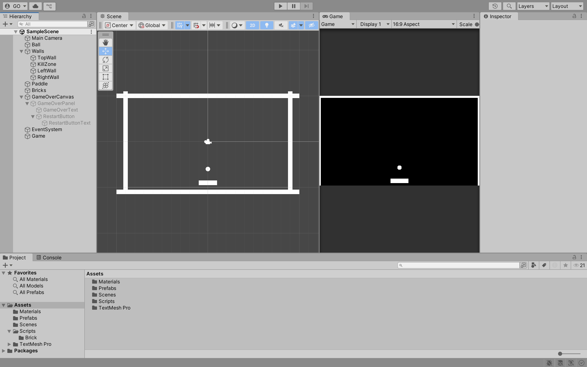
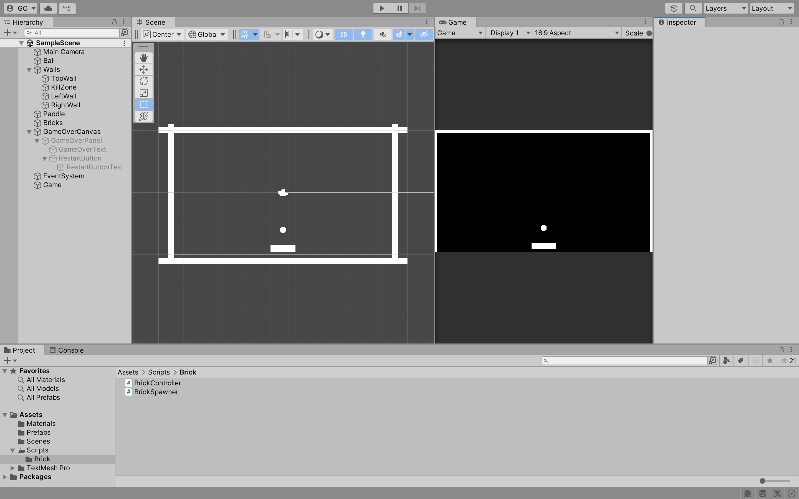
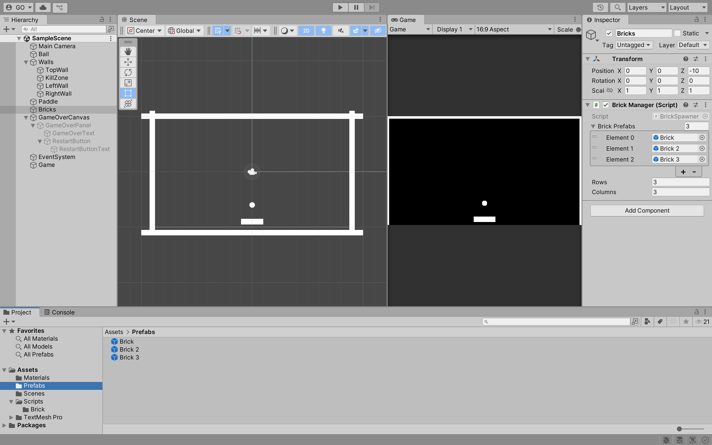

## Week 04

## Previous Class

Link to the previous class: [Week 03]()

---

## Breakout

In this module, you will continue to develop **Breakout** using Unity.

> **Note:** The following content does not take into account last week's formative assessment. Please ensure you have completed the formative assessment before continuing with this week's content. 

---

## Instantiate Bricks

Last week, you created `Brick`, `Brick1`, and `Brick2` prefabs. You then added these **Prefabs** to the scene. This is not a scalable solution. If you want to add more bricks to the scene, you would have to manually add them to the scene. You can use **Instantiate** to create bricks at runtime.

Delete all the `Brick` **GameObjects** in the `Bricks` **GameObject**.



In the **Assets > Scripts** folder, create a new folder called `Brick`. In the `Brick` folder, create a new script called `BrickSpawner`. 




In the `BrickSpawner` script, add the following code:

```csharp
using System.Collections;
using System.Collections.Generic;
using UnityEngine;

public class BrickSpawner : MonoBehaviour
{
    [SerializeField] private GameObject[] brickPrefabs;
    [SerializeField] private int rows = 3;
    [SerializeField] private int columns = 3;

    void Start()
    {
        GenerateBasicFormation();
    }

    private void GenerateBasicFormation()
    {
        GameObject firstBrick = brickPrefabs[0];
        float brickWidth = firstBrick.GetComponent<SpriteRenderer>().bounds.size.x;
        float brickHeight = firstBrick.GetComponent<SpriteRenderer>().bounds.size.y;

        float gap = 0.5f;
        float totalWidth = columns * brickWidth + (columns - 1) * gap;
        
        float startX = -totalWidth / 2 + brickWidth / 2;
        float startY = 5f - (brickHeight / 2) - 0.5f;

        for (int row = 0; row < rows; row++)
        {
            for (int col = 0; col < columns; col++)
            {
                int randomIndex = Random.Range(0, brickPrefabs.Length);
                float xPos = startX + col * (brickWidth + gap);
                float yPos = startY - row * (brickHeight + gap);
                Vector2 position = new Vector2(xPos, yPos);
                Instantiate(brickPrefabs[randomIndex], position, Quaternion.identity);
            }
        }
    }
}
```

Let's break down the code:

1. `GameObject firstBrick = brickPrefabs[0];` - Get the first `Brick` **Prefab** to calculate the width and height of the bricks.
2. `float brickWidth = firstBrick.GetComponent<SpriteRenderer>().bounds.size.x;` - Get the width of the `Brick` **Prefab**.
3. `float brickHeight = firstBrick.GetComponent<SpriteRenderer>().bounds.size.y;` - Get the height of the `Brick` **Prefab**.
4. `float gap = 0.5f;` - The gap between the bricks.
5. `float totalWidth = columns * brickWidth + (columns - 1) * gap;` - The total width of the bricks.
6. `float startX = -totalWidth / 2 + brickWidth / 2;` - The starting X position of the bricks. We subtract `totalWidth / 2` to align the bricks correctly. We then add `brickWidth / 2` to align the bricks correctly.
7. `float startY = 5f - (brickHeight / 2) - 0.5f;` - The starting Y position of the bricks. The `5f` is the height of the `TopWall` **GameObject**. We subtract `brickHeight / 2` to align the bricks correctly. We then subtract `0.5f` to give some space between the bricks and the `TopWall` **GameObject**.
8. Loop through the rows and columns to create the bricks. We calculate the X and Y positions of the bricks. We then instantiate the bricks at the calculated positions.

Attach the `BrickSpawner` script to the `Bricks` **GameObject**. Set the `Brick Prefabs` size to `3` and add the `Brick`, `Brick1`, and `Brick2` **Prefabs** to the `Brick Prefabs` array. 



Click the **Play** button to test the game. You should see the bricks being created at runtime.

---

## Creating Different Formations

You can create different formations of bricks. Here is an example of an X formation:

```csharp
// Omitted for brevity

public class BrickSpawner : MonoBehaviour
{
    // Omitted for brevity

    void Start()
    {
        // GenerateBasicFormation();
        GenerateXFormation();
    }

    // Omitted for brevity

    private void GenerateXFormation()
    {
        GameObject firstBrick = brickPrefabs[0];
        float brickWidth = firstBrick.GetComponent<SpriteRenderer>().bounds.size.x;
        float brickHeight = firstBrick.GetComponent<SpriteRenderer>().bounds.size.y;

        float gap = 0.5f;

        float totalWidth = columns * brickWidth + (columns - 1) * gap;
        float startX = -totalWidth / 2 + brickWidth / 2;
        float startY = 5f - (brickHeight / 2) - 0.5f;

        for (int row = 0; row < rows; row++)
        {
            // From top-left to bottom-right
            int leftCol = row;
            if (leftCol < columns)
            {
                float xPos = startX + leftCol * (brickWidth + gap);
                float yPos = startY - row * (brickHeight + gap);
                Vector2 position = new Vector2(xPos, yPos);
                int randomIndex = Random.Range(0, brickPrefabs.Length);
                Instantiate(brickPrefabs[randomIndex], position, Quaternion.identity);
            }

            // From top-right to bottom-left
            int rightCol = columns - row - 1;
            if (rightCol >= 0)
            {
                float xPos = startX + rightCol * (brickWidth + gap);
                float yPos = startY - row * (brickHeight + gap);
                Vector2 position = new Vector2(xPos, yPos);
                int randomIndex = Random.Range(0, brickPrefabs.Length);
                Instantiate(brickPrefabs[randomIndex], position, Quaternion.identity);
            }
        }
    }
}
```

---

## Factory Pattern

Currently, the `Instantiate` method is being called within the `GenerateBasicFormation` and `GenerateXFormation` methods. It is fine for small projects, but it is not a scalable solution. If you want to create different formations, you would have to create a new method for each formation. You can use design patterns to solve this problem. You will use two design patterns: **Factory Pattern** and **Strategy Pattern**. The **Factory Pattern** will be used to create bricks and the **Strategy Pattern** will be used to create different formations.

The **Factory Pattern** is a creational design pattern that provides an interface for creating objects in a superclass but allows subclasses to alter the type of objects that will be created.

---

### Brick Factory

You are going to do some refactoring. In the **Assets > Scripts > Brick** folder, create a new folder called `Factories`. In the `Factories` folder, create a new script called `BrickFactory`. In the `BrickFactory` script, add the following code:

```csharp
// Omitted for brevity

public abstract class BrickFactory
{
    protected GameObject[] brickPrefabs;

    public BrickFactory(GameObject[] brickPrefabs)
    {
        this.brickPrefabs = brickPrefabs;
    }

    public abstract GameObject CreateBrick(Vector2 position);
}
```

This is an abstract class that has an abstract method called `CreateBrick`. You will create concrete classes that inherit from this class and implement the `CreateBrick` method.

--- 

### Concrete Factory Classes

You will create two concrete classes that inherit from the `BrickFactory` class. In the `Factories` folder, create a new script called `AlternatingBrickFactory`. In the `AlternatingBrickFactory` script, add the following code:

```csharp
// Omitted for brevity

public class AlternatingBrickFactory : BrickFactory
{
    private int counter = 0;

    public AlternatingBrickFactory(GameObject[] brickPrefabs) : base(brickPrefabs) { }

    public override GameObject CreateBrick(Vector2 position)
    {
        int index = counter % brickPrefabs.Length;
        counter++;
        return Object.Instantiate(brickPrefabs[index], position, Quaternion.identity);
    }
}
```

This factory will create bricks in an alternating manner. For example, if you have three brick prefabs, it will create the first brick prefab, then the second brick prefab, and then the third brick prefab. It will then start over and create the first brick prefab again.

In the `Factories` folder, create a new script called `RandomBrickFactory`. In the `RandomBrickFactory` script, add the following code:

```csharp
// Omitted for brevity

using System.Collections;
using System.Collections.Generic;
using UnityEngine;

public class RandomBrickFactory : BrickFactory
{
    public RandomBrickFactory(GameObject[] brickPrefabs) : base(brickPrefabs) { }

    public override GameObject CreateBrick(Vector2 position)
    {
        int randomIndex = Random.Range(0, brickPrefabs.Length);
        return Object.Instantiate(brickPrefabs[randomIndex], position, Quaternion.identity);
    }
}
```

This factory will create bricks randomly. It will randomly select a brick prefab from the array of brick prefabs.


---

## Strategy Pattern

The **Strategy Pattern** is a design pattern that defines a family of algorithms, encapsulates each algorithm, and makes the algorithms interchangeable within that family. 

---

### Brick Formation

In the **Assets > Scripts > Brick** folder, create a new folder called `Formations`. In the `Formations` folder, create a new script called `IFormationStrategy`. In the `IFormationStrategy` script, add the following code:

```csharp
// Omitted for brevity

public interface IFormationStrategy
{
    void Generate(BrickFactory brickFactory, int rows, int columns, Vector2 startPosition, float brickWidth, float brickHeight, float gap);
}
```

This interface has a method called `Generate`. You will create concrete classes that implement this interface.

---

### Concrete Strategy Classes

You will create two concrete classes that implement the `IFormationStrategy` interface. In the `Formations` folder, create a new script called `BasicFormationStrategy`. In the `BasicFormationStrategy` script, add the following code:

```csharp
// Omitted for brevity

public class BasicFormationStrategy : IFormationStrategy
{
    public void Generate(BrickFactory brickFactory, int rows, int columns, Vector2 startPosition, float brickWidth, float brickHeight, float gap)
    {
        for (int row = 0; row < rows; row++)
        {
            for (int col = 0; col < columns; col++)
            {
                float xPos = startPosition.x + col * (brickWidth + gap);
                float yPos = startPosition.y - row * (brickHeight + gap);
                brickFactory.CreateBrick(new Vector2(xPos, yPos));
            }
        }
    }
}
```

This class will generate bricks in a basic formation. In the `Formations` folder, create a new script called `XFormationStrategy`. In the `XFormationStrategy` script, add the following code:

```csharp
// Omitted for brevity

public class XFormationStrategy : IFormationStrategy
{
    public void Generate(BrickFactory brickFactory, int rows, int columns, Vector2 startPosition, float brickWidth, float brickHeight, float gap)
    {
        for (int row = 0; row < rows; row++)
        {
            int leftCol = row;
            if (leftCol < columns)
            {
                float xPos = startPosition.x + leftCol * (brickWidth + gap);
                float yPos = startPosition.y - row * (brickHeight + gap);
                brickFactory.CreateBrick(new Vector2(xPos, yPos));
            }

            int rightCol = columns - row - 1;
            if (rightCol >= 0)
            {
                float xPos = startPosition.x + rightCol * (brickWidth + gap);
                float yPos = startPosition.y - row * (brickHeight + gap);
                brickFactory.CreateBrick(new Vector2(xPos, yPos));
            }
        }
    }
}
```

---

## Brick Spawner

In the `BrickSpawner` script, update the code as follows:

```csharp
// Omitted for brevity

public class BrickSpawner : MonoBehaviour
{
    // Omitted for brevity
    [SerializeField] private string formationType = "Basic";
    [SerializeField] private string factoryType = "Random";

    private BrickFactory brickFactory;
    private IFormationStrategy formationStrategy;
    
    void Start()
    {
        SetBrickFactory(factoryType);
        SetFormationStrategy(formationType);
        GenerateBricks();
    }

    private void SetBrickFactory(string type)
    {
        switch (type)
        {
            case "Random":
                brickFactory = new RandomBrickFactory(brickPrefabs);
                break;
            case "Alternating":
                brickFactory = new AlternatingBrickFactory(brickPrefabs);
                break;
            default:
                break;
        }
    }

    public void SetFormationStrategy(string type)
    {
        switch (type)
        {
            case "Basic":
                formationStrategy = new BasicFormation();
                break;
            case "X":
                formationStrategy = new XFormation();
                break;
            default:
                break;
        }
    }

    private void GenerateBricks()
    {
        if (formationStrategy == null || brickFactory == null)
        {
            return;
        }

        GameObject firstBrick = brickPrefabs[0];
        float brickWidth = firstBrick.GetComponent<SpriteRenderer>().bounds.size.x;
        float brickHeight = firstBrick.GetComponent<SpriteRenderer>().bounds.size.y;
        float gap = 0.5f;

        float totalWidth = columns * brickWidth + (columns - 1) * gap;
        Vector2 startPosition = new Vector2(-totalWidth / 2 + brickWidth / 2, 5f - (brickHeight / 2) - 0.5f);

        formationStrategy.Generate(brickFactory, rows, columns, startPosition, brickWidth, brickHeight, gap);
    }
}
```

In the `BrickSpawner` script, you have added two new fields: `formationType` and `factoryType`. These fields will be used to set the formation and factory types in the Unity Inspector. You have also added two new fields: `brickFactory` and `formationStrategy`. These fields will be used to store the brick factory and formation strategy objects.

Click the **Play** button to test the game. You should see the bricks being created at runtime.

---

## Formative Assessment

Learning to use AI tools is an important skill. While AI tools are powerful, you **must** be aware of the following:

- If you provide an AI tool with a prompt that is not refined enough, it may generate a not-so-useful response
- Do not trust the AI tool's responses blindly. You **must** still use your judgement and may need to do additional research to determine if the response is correct
- Acknowledge what AI tool you have used. In the assessment's repository **README.md** file, please include what prompt(s) you provided to the AI tool and how you used the response(s) to help you with your work

---

### Submission

Create a new pull request and assign **grayson-orr** to review your practical submission. Please do not merge your own pull request.

---

## Next Class

Link to the next class: [Week 05]()
