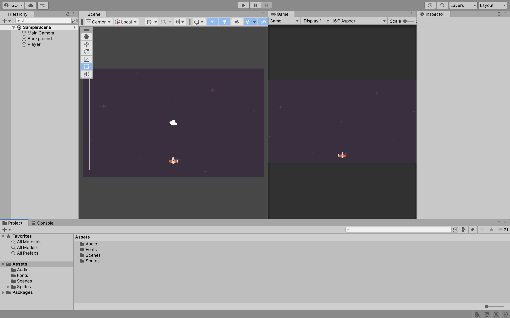
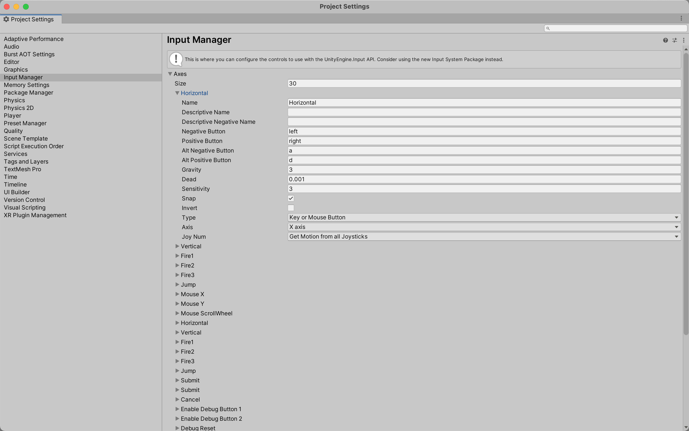
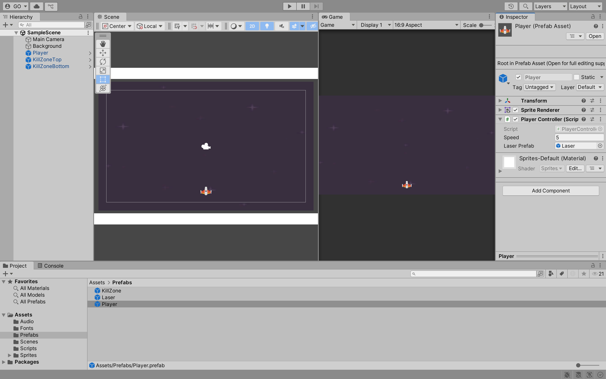
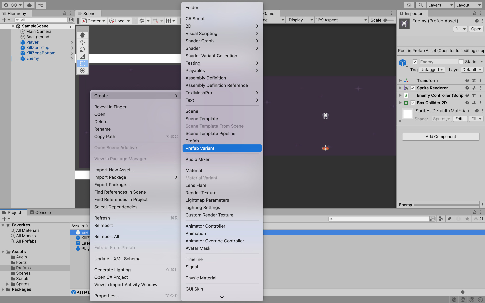
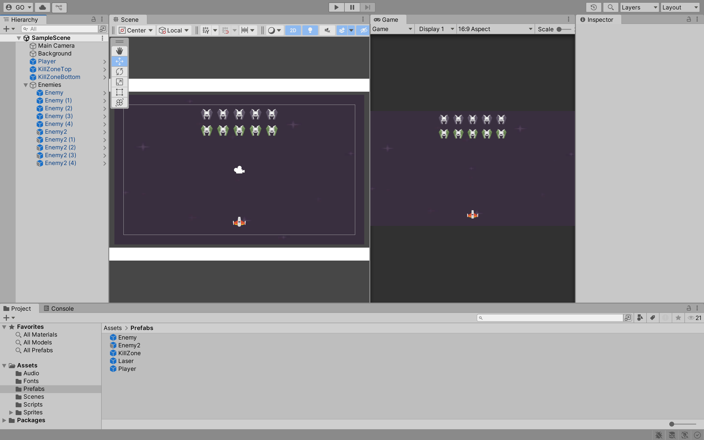

## Week 05

## Previous Class

Link to the previous class: [Week 04](https://github.com/otago-polytechnic-bit-courses/ID623001-introductory-game-development/blob/main-s1-25/lecture-notes/04-instantiate-design-patterns-audio-scene-management-assets.md)

---

## Space Invaders Game

In this module, you will develop **Space Invaders** using **Unity**. Create a new **Unity** project using the **2D (Built-In Render Pipeline)** template. Name your project `breakout` and select a location to save your project. Click on the **Create project** button.

---

## Assets

In the **lecture-notes** folder, you will find a folder named **05-assets**. Inside this folder, you will find the audio, font and sprite assets required for the **Space Invaders** game. Drag and drop the folders in the **05-assets** folder into the **Assets** folder.

---

## Background and Player

**Tasks:**

1. Create a new **GameObject** for the background. Add a **Sprite Renderer** component to the **GameObject**. Drag and drop a background sprite from the **Sprites** folder into the **Sprite** field of the **Sprite Renderer** component.
2. Set the **Order in Layer** to **-1**. This will ensure that the background is rendered behind other **GameObjects**.
3. Create a new **GameObject** for the player. Add a **Sprite Renderer** component to the **GameObject**. Drag and drop a player sprite from the **Sprites** folder into the **Sprite** field of the **Sprite Renderer** component.



4. In the **Assets** folder, create a new folder called **Prefabs**. Drag and drop the player **GameObject** into the **Prefabs** folder to create a prefab.

---

## Input Manager

In **Unity**, you can use the **Input Manager** to manage input from the keyboard, mouse and other input devices. The **Input Manager** is a system that allows you to define input axes and buttons. You can then access these axes and buttons in your scripts.



---

## Player Movement

Create a new script called `PlayerController` and attach it to the player **Prefab**. In the `PlayerController` script, add the following code:

```csharp
// Omitted for brevity

public class PlayerController : MonoBehaviour
{
    [SerializeField] float speed = 5f;

    void Update()
    {
        float direction = Input.GetAxis("Horizontal");   
        transform.position += Vector3.right * direction * Time.deltaTime * speed;
    }
}
```

What does this code do?

- The `speed` variable is used to control the speed of the player.
- The `Update` method is called once per frame. In the `Update` method, `Input.GetAxis("Horizontal")` is used to get the  horizontal input. This returns a value between -1 and 1 based on the input from the keyboard, where -1 is left and 1 is right.
- Move the player in the horizontal direction based on the input. Multiply the direction by the speed and `Time.deltaTime` to make the movement frame rate independent. `Time.deltaTime` is the time in seconds it took to complete the last frame. 

Click on the **Play** button to test the player movement. The player should move left and right based on the input from the keyboard.

---

## Clamping Player Movement

To prevent the player from moving outside the screen, player's position is clamped using the `Mathf.Clamp` method. Update the `PlayerController` script as follows:

```csharp
// Omitted for brevity

public class PlayerController : MonoBehaviour
{
    // Omitted for brevity

    void Update()
    {
        // Omitted for brevity

        float clampedX = Mathf.Clamp(transform.position.x, -8f, 8f);
        transform.position = new Vector3(clampedX, transform.position.y, 0);
    }
}
```

What does this code do?

- Use the `Mathf.Clamp` method to clamp the player's position in the x-axis between -10 and 10. This ensures that the player cannot move outside the screen.
- Update the player's position using the clamped x value and the original y value.
- The z value is set to 0 to ensure that the player remains in the 2D plane.

Click on the **Play** button to test the player movement. The player should move left and right within the screen bounds.

---

## Player Shooting

**Tasks:**

1. Create a new **GameObject** for the laser. 
2. Drag and drop the laser **GameObject** into the **Prefabs** folder to create a prefab.
3. Add a **Sprite Renderer** component to the laser **Prefab**. Drag and drop a laser sprite from the **Sprites** folder into the **Sprite** field of the **Sprite Renderer** component.
4. Add a **Box Collider 2D** component to the laser **Prefab**. Set the **Is Trigger** property to **true**.
5. Add a **Rigidbody 2D** component to the laser **Prefab**. Set the **Body Type** property to **Kinematic**. This will allow us to move the laser using the `transform.Translate` method without the need for physics calculations.
6. Create a **Tag** called `Laser` and assign it to the laser **Prefab**.
7. Create a new script called `LaserController` and attach it to the laser **Prefab**. In the `LaserController` script, add the following code:

```csharp
public class PlayerLaser : MonoBehaviour
{
    [SerializeField] float speed = 5f;

    void Update()
    {
        transform.Translate(Vector3.up * speed * Time.deltaTime);
    }
}
```

What does this code do?

- The `speed` variable is used to control the speed of the laser.
- The `Update` method is called once per frame. In the `Update` method, the laser moves on the y-axis based on the speed value.

Click on the **Play** button to test the laser movement. The laser should move upwards based on the speed value.

**Task:**

1. You can recall creating a kill zone in the **Breakout** game. Create a similar kill zone at the top and bottom of the screen to destroy the laser when it collides with the kill zone.



---

## Instantiating Player Laser

**Tasks:**

1. Delete the laser **Prefab** from the **Scene**.
2. Update the `PlayerController` script as follows:

```csharp
// Omitted for brevity

public class PlayerController : MonoBehaviour
{
    // Omitted for brevity
    [SerializeField] GameObject laserPrefab;

    float counter = 0f;

    void Update()
    {
        // Omitted for brevity

        counter += Time.deltaTime;
        if (Input.GetButtonDown("Fire1") && counter > 0.5f)
        {
            Instantiate(laserPrefab, transform.position, Quaternion.identity);
            counter = 0f;
        }
    }
}
```

What does this code do?

- Add a `laserPrefab` variable to store a reference to the laser **Prefab**.
- Add a `counter` variable to keep track of the time since the last laser was fired. This is used to prevent the player from firing multiple lasers in quick succession.
- In the `Update` method, increment the `counter` value by `Time.deltaTime`.
- Check if the **Fire1** button is pressed and the `counter` value is greater than 0.5 seconds. If both conditions are met, instantiate a laser at the player's position and reset the `counter` value.

Click on the **Play** button to test the player shooting. The player should be able to shoot lasers by pressing the **Fire1** button.

---

## Enemy Prefab

**Tasks:**

1. Create a new **GameObject** for the enemy. Add a **Sprite Renderer** component to the **GameObject**. Drag and drop an enemy sprite from the **Sprites** folder into the **Sprite** field of the **Sprite Renderer** component.
2. Add a **Box Collider 2D** component to the **GameObject**. Set the **Is Trigger** property to **true**.
3. Create a new script called `EnemyController` and attach it to the enemy **GameObject**. In the `EnemyController` script, add the following code:

```csharp
// Omitted for brevity

public class EnemyController : MonoBehaviour
{
    private void OnTriggerEnter2D(Collider2D collision)
    {
        if (collision.gameObject.CompareTag("Laser"))
        {
            // TODO: Write code to destroy the laser
            // TODO: Write code to destroy the enemy
        }
    }
}
```

Click on the **Play** button to test the enemy collision. The enemy and the laser should be destroyed when they collide.

---

## Prefab Variants

**Prefab Variants** are copies of a **Prefab** that inherit the properties of the original **Prefab**. You can create **Prefab Variants** to create variations of a **Prefab** without modifying the original **Prefab**.

To create a **Prefab Variant**, right-click on the `Enemy` **Prefab** in the **Prefabs** folder and select **Create > Prefab Variant**. This will create a new **Prefab Variant** of the `Enemy` **Prefab**. Rename the **Prefab Variant** to `Enemy2`.



**Task:**

1. Create a parent **GameObject** called `Enemies` in the **Scene**.
2. In the `Enemies` **GameObject**, add `Enemy` and `Enemy2` **Prefabs** as children.




---

## Next Class

Link to the next class: [Week 06]()