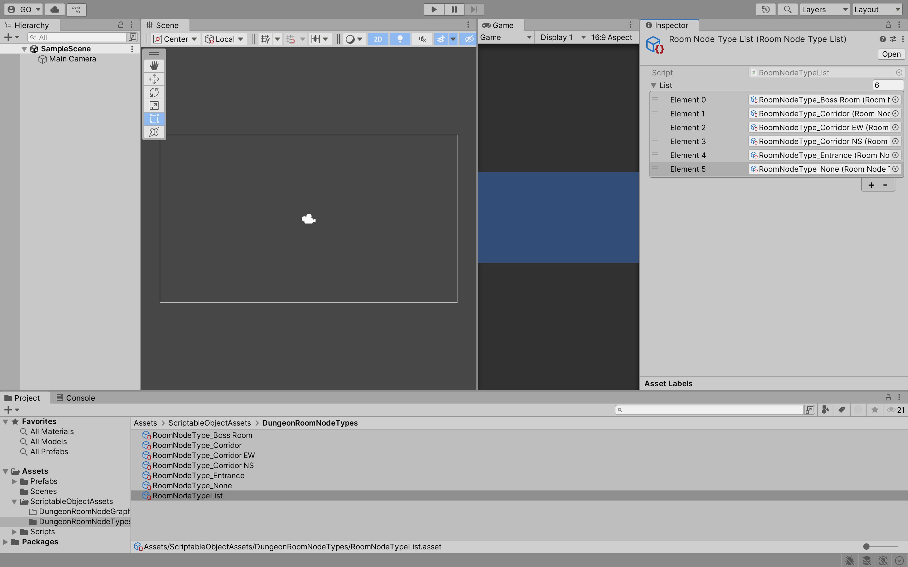
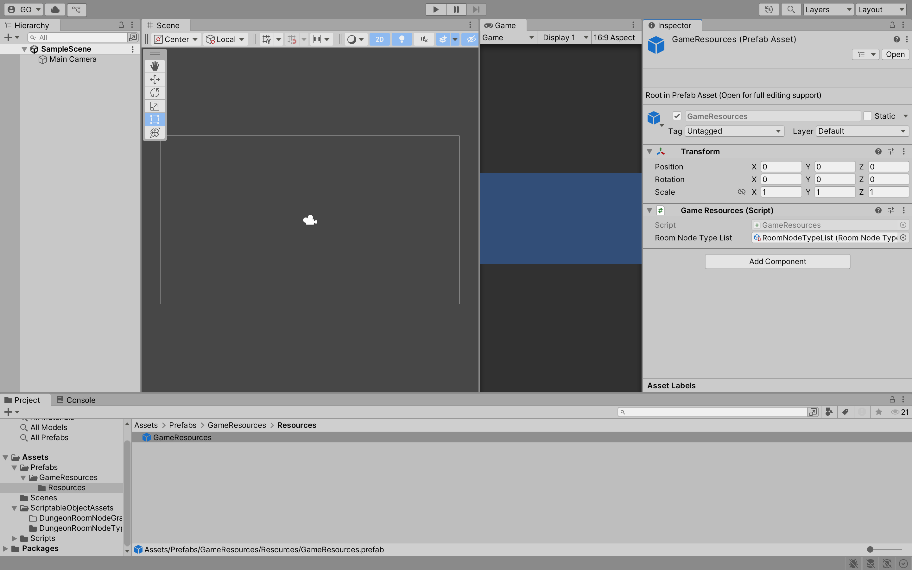
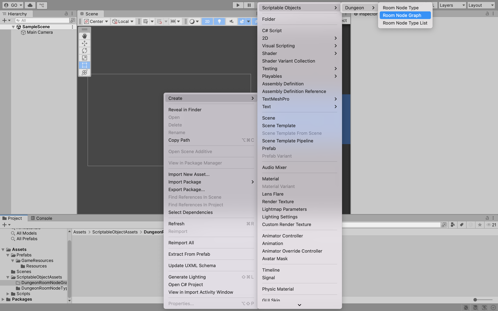
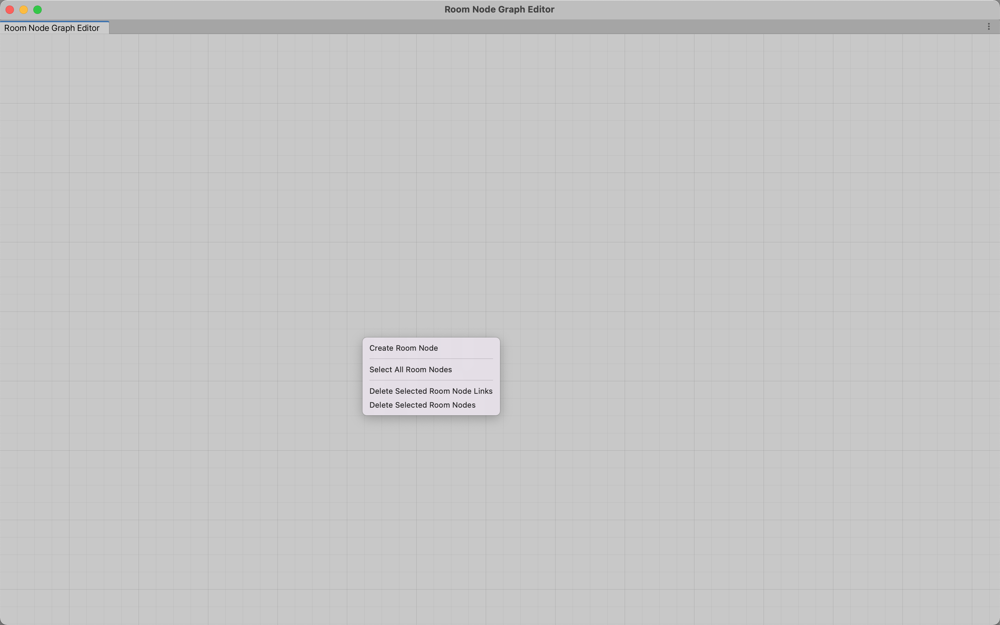
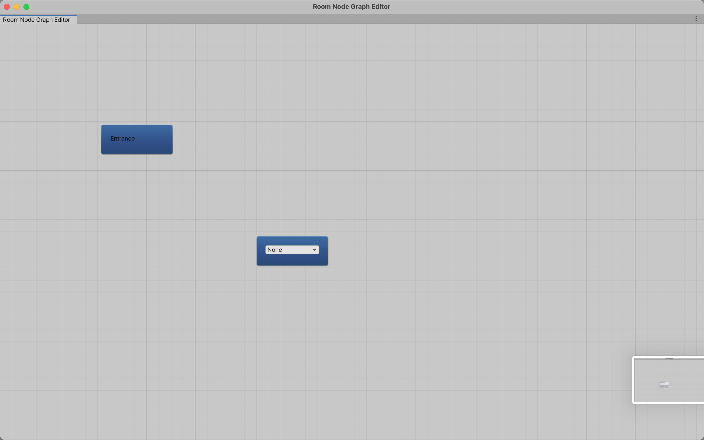
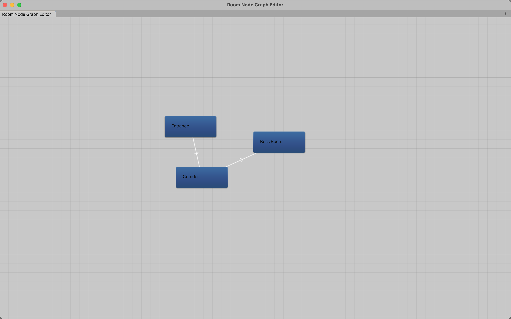

## Week 07

## Previous Class

Link to the previous class: [Week 07](https://github.com/otago-polytechnic-bit-courses/ID623001-introductory-game-development/blob/main-s1-25/lecture-notes/06-invoke-api-integration-saving-to-file.md)

---

## Rouge-Like Game

In this module, you will develop **Rouge-Like** using **Unity**. Create a new **Unity** project using the **2D (Built-In Render Pipeline)** template. Name your project `rogue-like` and select a location to save your project. Click on the **Create project** button.

---

## Folder Structure

In the **Assets** folder, create the following folder structure:

```bash
Assets
├── Prefabs
│   └── GameResources
│       └── Resources
├── Scenes
├── ScriptableObjectAssets
│   ├── DungeonRoomNodeGraphs
│   └── DungeonRoomNodeTypes
└── Scripts
   ├── Editor
   └── ScriptableObjects
       └── NodeGraph
```

---

## Custom Editor Window

In **Unity**, you can create custom editor windows to enhance your workflow and provide a more tailored experience for your specific needs. Custom editor windows can be used to create tools, utilities or visualisations that are not part of the standard **Unity** interface.

In the **lecture-notes > 07-helper-files**, copy and paste the `RoomGraphNodeEditor.cs` file into the `Assets > Scripts > Editor` folder. Please read the code and understand how it works. 

> **Note:** The `Editor` folder is a special folder in **Unity** that contains scripts that are only compiled in the **Editor**. This means that any scripts in this folder will not be included in the final build of your game, which is useful for creating custom editor tools and utilities.

---

## Scriptable Objects

**Scriptable objects** are a powerful feature in **Unity** that allow you to create data containers that can be easily reused and shared across different parts of your project. They are particularly useful for storing configuration data, game settings, and other types of data that need to be shared between different game objects or scenes.

In the **lecture-notes > 07-helper-files**, copy and paste the `RoomNode.cs`, `RoomNodeGraph.cs`, `RoomNodeType.cs` and `RoomNodeTypeList.cs` files into the `Assets > Scripts > ScriptableObjects > NodeGraph` folder. Please read the code and understand how it works.

---

### Scriptable Object Assets

In the **Assets > ScriptableObjectAssets > DungeonRoomNodeTypes** folder, right-click on the window and select **Create > ScriptableObjects > Dungeon > Room Node Type**. 

Name the new **Scriptable Object** `RoomNodeType_Boss Room`. Set the `Room Node Type Name` to `Boss Room`, the `Display In Node Graph Editor` to `True` and `Is Boss Room` to `True`.

**Task:** Create a new **Scriptable Object** for the following room node types:
  - `RoomNodeType_Corridor`
  - `RoomNodeType_Corridor EW`
  - `RoomNodeType_Corridor NS`
  - `RoomNodeType_Entrance`
  - `RoomNodeType_None`

Provide appropriate values for each room node type.

In the **Assets > ScriptableObjectAssets > DungeonRoomNodeTypes** folder, right-click on the window and select **Create > ScriptableObjects > Dungeon > Room Node Type List**. 

Name the new **Scriptable Object** `RoomNodeTypeList`. In the `RoomNodeTypeList` scriptable object, add the following room node types:
  - `RoomNodeType_Boss Room`
  - `RoomNodeType_Corridor`
  - `RoomNodeType_Corridor EW`
  - `RoomNodeType_Corridor NS`
  - `RoomNodeType_Entrance`
  - `RoomNodeType_None`



---

## Game Resources

In the **Assets > Scripts** folder, create a new script called `GameResources.cs`. In the `GameResources.cs` file, add the following code:

```csharp
using System.Collections.Generic;
using UnityEngine;

public class GameResources : MonoBehaviour
{
    public RoomNodeTypeList roomNodeTypeList;

    private static GameResources instance;
    
    public static GameResources Instance
    {
        get
        {
            if (instance == null)
            {
                instance = Resources.Load<GameResources>("GameResources");
            }
            return instance;
        }
    }
}
```

This script is a singleton that allows you to access the `RoomNodeTypeList` scriptable object from anywhere in your code. 

> **Note:** The `Resources` folder is a special folder in **Unity** that allows you to load assets at runtime using the `Resources.Load` method.

---

### Game Resources Prefab

In the **Assets > Prefabs > GameResources > Resources** folder, create a new prefab called `GameResources` and attach the `GameResources` script to it. Set the `Room Node Type List` field to the `RoomNodeTypeList` scriptable object.



---

## Node Graph Editor

In the **Assets > ScriptableObjectAssets > DungeonRoomNodeGraphs** folder, right-click on the window and select **Create > ScriptableObjects > Dungeon > Room Node Graph**. 



Double-click on the `RoomNodeGraph` scriptable object to open the **Node Graph Editor**.

Right-click on the window and select **Create Room Node**. 



This will create an entrance and none node.



Create a corridor and boss room node. Join the entrance node to the corridor node, and the corridor node to the boss room node.



---

## Formative Assessment

Learning to use AI tools is an important skill. While AI tools are powerful, you **must** be aware of the following:

- If you provide an AI tool with a prompt that is not refined enough, it may generate a not-so-useful response
- Do not trust the AI tool's responses blindly. You **must** still use your judgement and may need to do additional research to determine if the response is correct
- Acknowledge what AI tool you have used. In the assessment's repository **README.md** file, please include what prompt(s) you provided to the AI tool and how you used the response(s) to help you with your work

---

### Task 1

Create room node types for the following rooms:

- Large room
- Small room
- Treasure room
- Trap room

---

### Task 2

Create a room node graph that has two large rooms, four small rooms, two treasure rooms, two trap rooms and one boss room. 

---

## Next Class

Link to the next class: [Week 08](https://github.com/otago-polytechnic-bit-courses/ID623001-introductory-game-development/blob/main-s1-25/lecture-notes/08-cinemachine-pixel-perfect-layers-tilemaps.md)