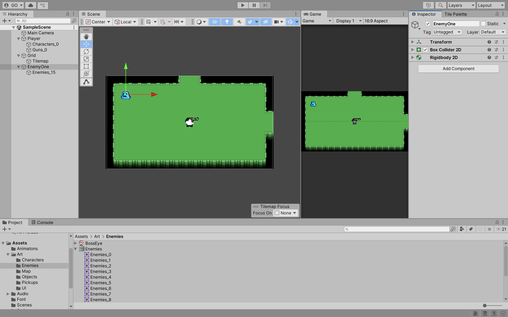
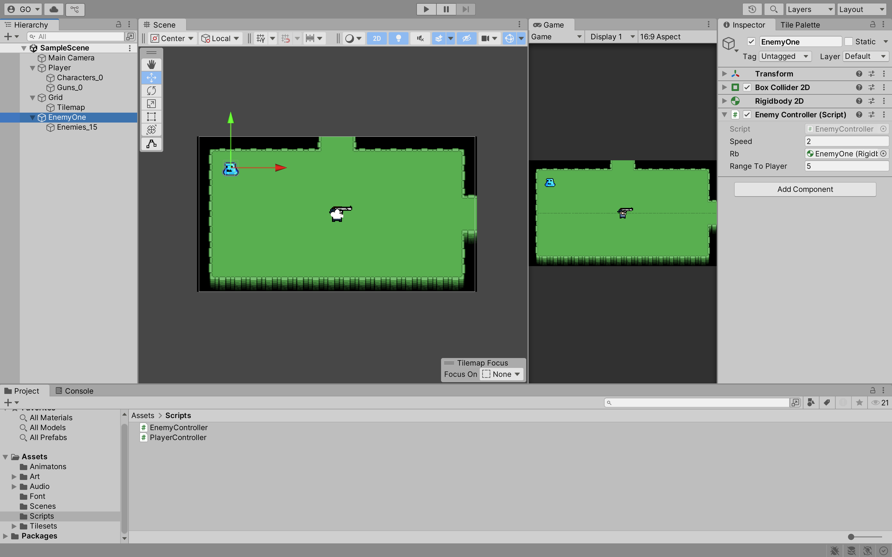
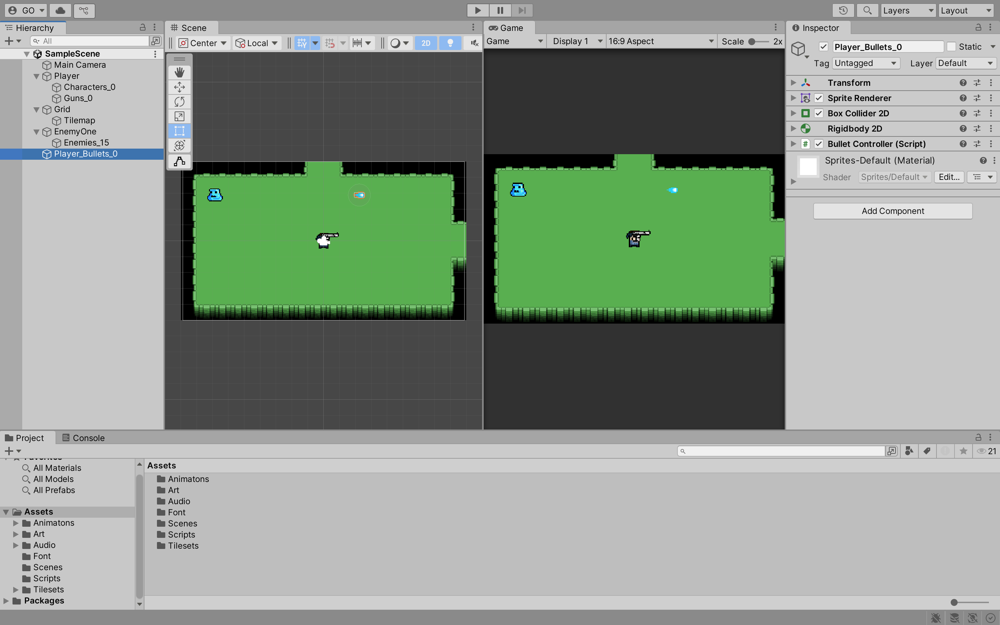
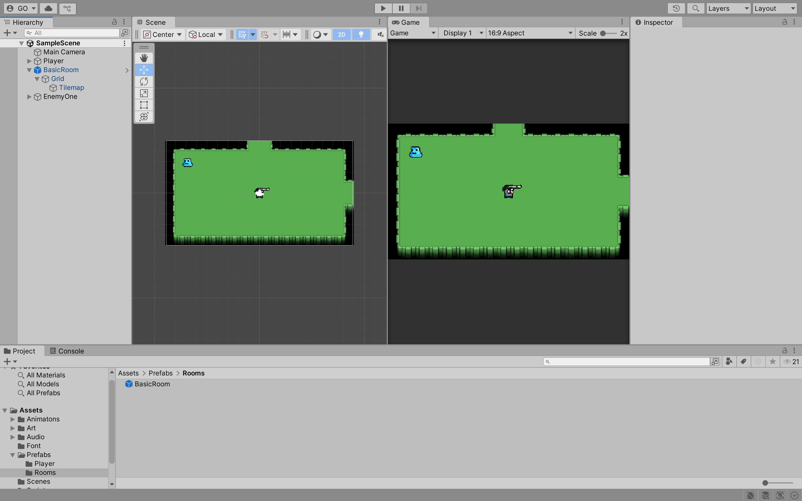
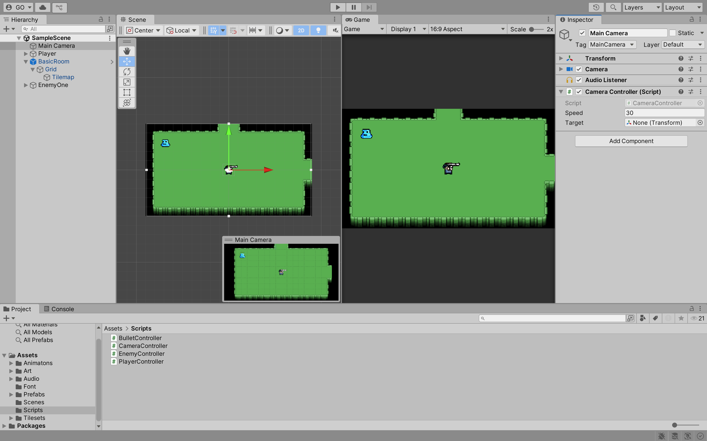
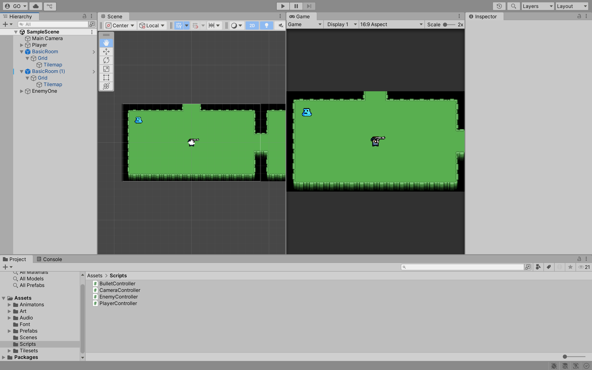
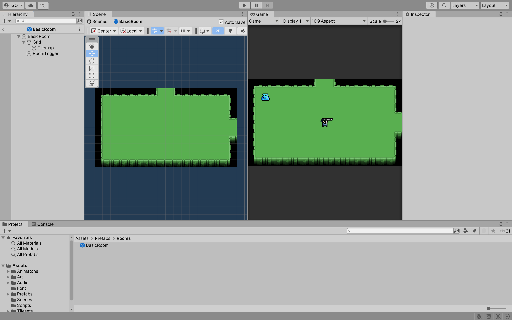
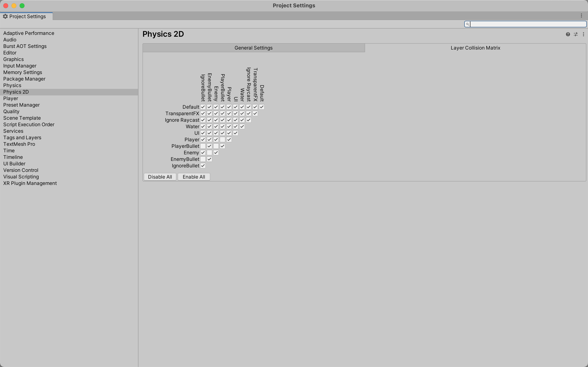

## Week 09

## Previous Class

Link to the previous class: [Week 08](https://github.com/otago-polytechnic-bit-courses/ID623001-introductory-game-development/blob/main-s1-25/lecture-notes/08-animation-tilemaps-tile-palettes.md)

---

## Rogue-Like Game

In this module, you will continue to develop **Rogue-Like** using Unity.

> **Note:** The following content does not take into account last week's formative assessment. Please ensure you have completed the formative assessment before continuing with this week's content. 

---

## Player

In the `PlayerController` **Script**, add the following code:

```csharp
public static PlayerController Instance;

void Awake()
{
    if (Instance == null)
    {
        Instance = this;
    }
    else
    {
        Destroy(gameObject);
    }
}
```

This will allow you to access the `PlayerController` class from other classes. For example, you can access the `PlayerController` class from the `EnemyController` class.

---

## Enemy

Create a **Game Object** for an enemy. The setup should be similar to the player.



**Task:** Create an idling and walking animation for the enemy. 

Create a new **Script** called `EnemyController` and attach it to the enemy. Add the following code to the script:

```csharp
using System.Collections;
using System.Collections.Generic;
using UnityEngine;

public class EnemyController : MonoBehaviour
{
    [SerializeField] private float speed = 2f;   
    
    [SerializeField] private Rigidbody2D rb;

    [SerializeField] private float rangeToPlayer;

    private Vector3 direction;

    void Update()
    {
        if (Vector3.Distance(transform.position, PlayerController.Instance.transform.position) < rangeToPlayer)
        {
            direction = PlayerController.Instance.transform.position - transform.position;
        }
        else
        {
            direction = Vector3.zero;
        }

        direction.Normalize();
        rb.velocity = direction * speed;
    }
}
```

What is happening in the code above?

In the `Update` method, we are checking if the player is within a certain range of the enemy. If the player is within that range, we set the direction of the enemy to move towards the player. If the player is outside that range, we set the direction to zero, which stops the enemy from moving.



**Task:** Write some code so that when the enemy is moving left or right, the enemy is facing the direction it is moving.

---

## Bullet 

Create a **Game Object** for a bullet. A bullet should have a **Box Collider 2D** and a **Rigidbody 2D** component. In the **Scripts** folder, create a new **Script** called `BulletController` and attach it to the bullet. 



**Tasks:** 

1. Write the code to make the bullet **Game Object** move in the direction it is facing. The bullet **Game Object** should be destroyed when it collides with an enemy. 
2. Drag and drop the bullet **Game Object** into the **Prefabs** folder. Delete the bullet **Game Object** from the **Hierarchy**.
3. Write the code to make the `Player` **Game Object** shoot a bullet. The bullet should be instantiated at the `Player` **Game Object** position and move in the direction the `Player` is facing.

---

## Room

Create a new **Game Object** called `BasicRoom`. Move the `Grid` and `Tilemap` **Game Objects** into the `BasicRoom` **Game Object**. Drag and drop the `BasicRoom` **Game Object** into the **Prefabs** folder.


---

## Main Camera

You are going to write the code to make the camera follow the `Player` **Game Object**. For example, if the `Player` **Game Object** moves from one room to another, the camera should follow the `Player` **Game Object**. 

Create a new **Script** called `CameraController` and attach it to the **Main Camera**. 

```csharp
using System.Collections;
using System.Collections.Generic;
using UnityEngine;

public class CameraController : MonoBehaviour
{
    public static CameraController Instance;

    [SerializeField] private float speed = 30f;

    [SerializeField] private Transform target;

    void Awake()
    {
        if (Instance == null)
        {
            Instance = this;
        }
        else
        {
            Destroy(gameObject);
        }
    }

    void Update()
    {
        if (target != null)
        {
            transform.position = Vector3.MoveTowards(transform.position, new Vector3(target.position.x, target.position.y, transform.position.z), speed * Time.deltaTime);
        }
    }

    public void ChangeTarget(Transform newTarget)
    {
        target = newTarget;
    }
}
```

What is happening in the code above?

- In the `Update` method, we are checking if the target is not null. If it is not null, we move the camera towards the target's position using `Vector3.MoveTowards`. The camera will move at a speed of `speed` units per second.
- The `ChangeTarget` method allows us to change the target of the camera. This is useful when we want to change the target from the player to another object, such as an enemy.



**Task:** Add a `BasicRoom` **Prefab** to the scene. You should be able to move the `Player` **Game Object** between the rooms. However, the camera will not follow the `Player` **Game Object** when it moves between rooms.



---

## Room Trigger

You need a way to trigger the camera to change its target when the player enters a new room.

In the **Scripts** folder, create a new **Script** called `Room` and attach it to the `BasicRoom` **Prefab**. In the `Room` **Script**, add the following code:

```csharp
using System.Collections;
using System.Collections.Generic;
using UnityEngine;

public class Room : MonoBehaviour
{
    private void OnTriggerEnter2D(Collider2D collision)
    {
        if (collision.CompareTag("Player"))
        {
            CameraController.Instance.ChangeTarget(transform);
        }
    }
}
```

> **Note:** Make sure you create a **Tag** called `Player` and assign it to the `Player` **Game Object**.

What is happening in the code above?

In the `OnTriggerEnter2D` method, we are checking if the player has entered the trigger collider of the room. If the player has entered the trigger collider, we call the `ChangeTarget` method of the `CameraController` class and pass in the transform of the room as the new target.

Create a new **Game Object** called `RoomTrigger` and add a **Box Collider 2D** component to it. Set the `Is Trigger` property to true, and set the `Size - X` property to `16` and the `Size - Y` property to `8`.



---

## Collision Layers

**Collision layers** are used to determine which objects can collide with each other. 

In the **Hierarchy** window, click on any **Game Object**. In the **Inspector** window, click on the **Layer dropdown > Add Layer...**. Add the following layers:

- Player
- PlayerBullet
- IgnoreBullet

In the **Project Settings** window, click on **Physics 2D**. In the **Layer Collision Matrix**, uncheck the following boxes:

- Player and PlayerBullet
- PlayerBullet and PlayerBullet



> **Note:** Assign the following layers to the corresponding **Game Objects/Prefabs**:

- `Player` **Game Object** should be assigned to the `Player` layer
- `PlayerBullet` **Prefab** should be assigned to the `PlayerBullet` layer
- `RoomTrigger` **Game Object** should be assigned to the `IgnoreBullet` layer

---

## Next Class

Link to the next class: [Week 10]()