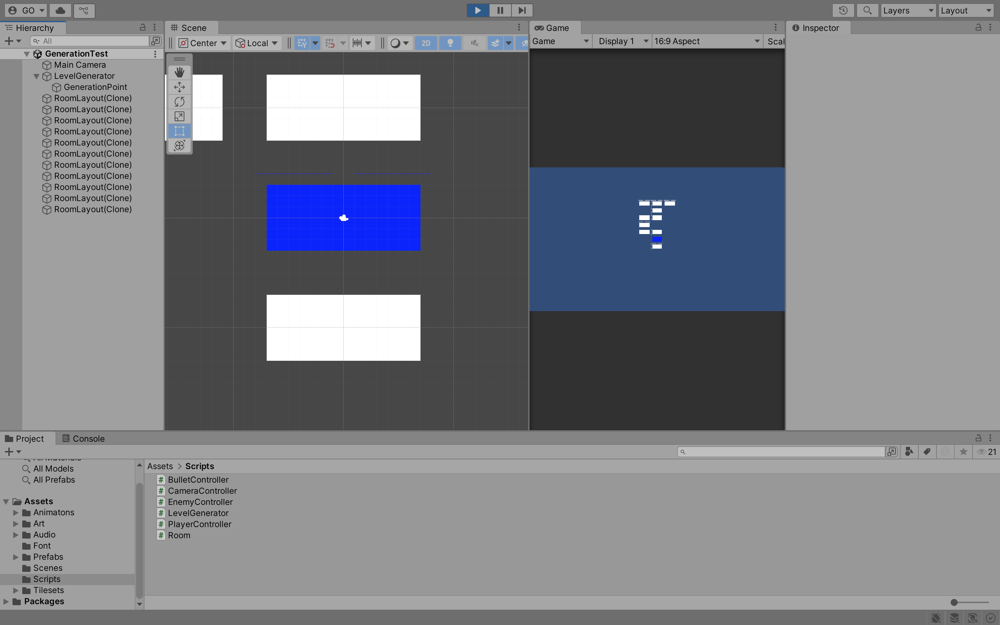
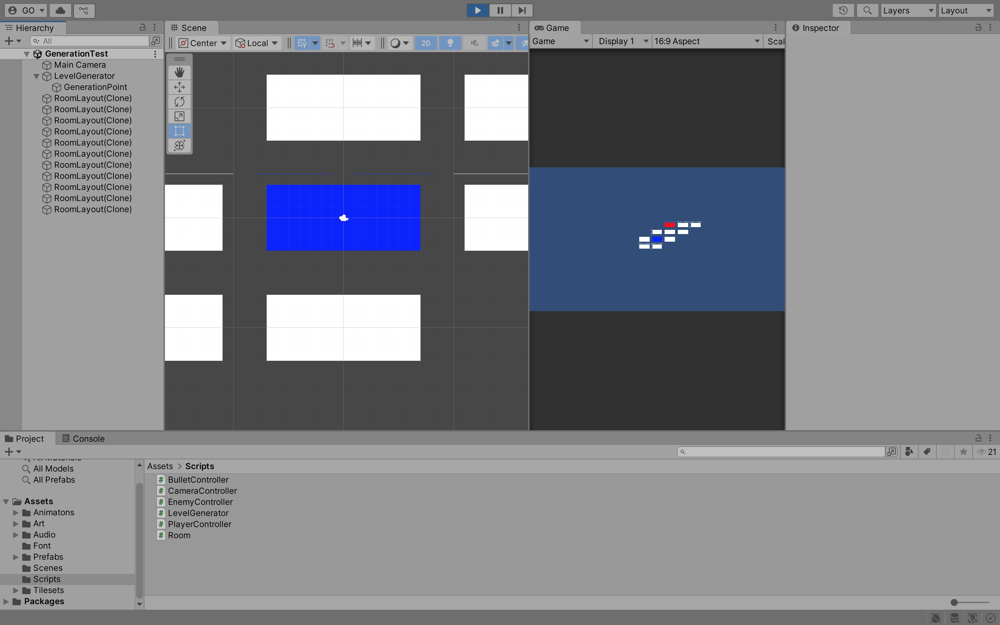
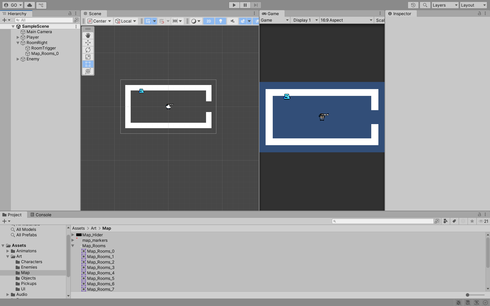
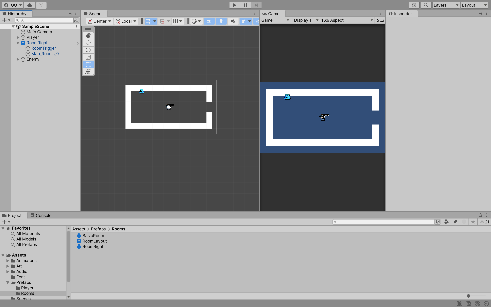
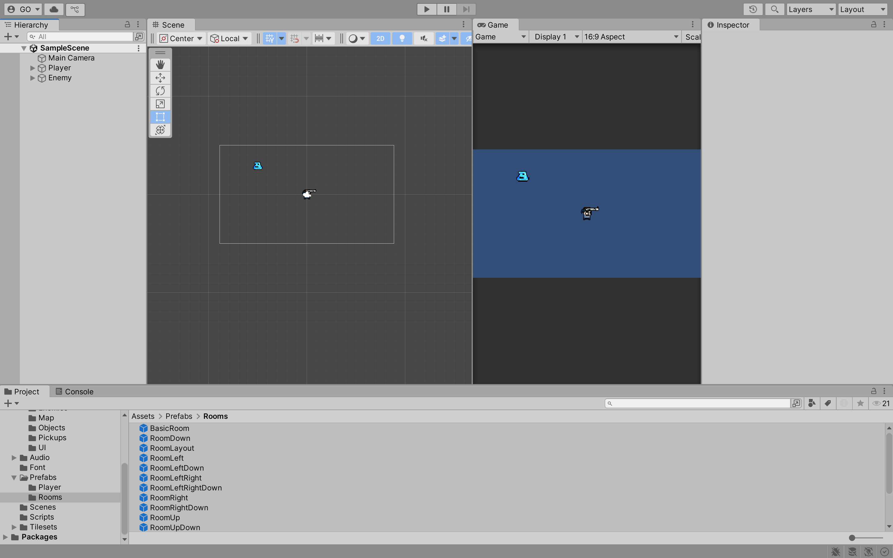
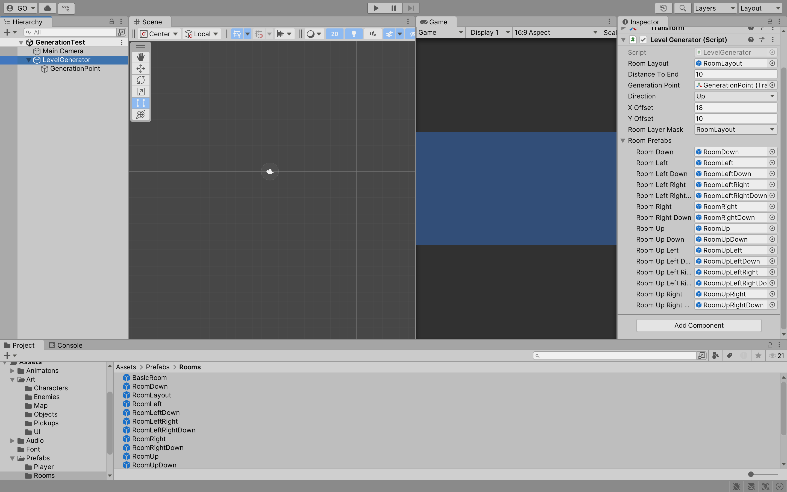

## Week 09

## Previous Class

Link to the previous class: [Week 08](https://github.com/otago-polytechnic-bit-courses/ID623001-introductory-game-development/blob/main-s1-25/lecture-notes/08-animation-tilemaps-tile-palettes.md)

---

## Rogue-Like Game

In this module, you will continue to develop **Rogue-Like** using Unity.

> **Note:** The following content does not take into account last week's formative assessment. Please ensure you have completed the formative assessment before continuing with this week's content. 

---

## Random Generation

**Random Generation** is a technique used in game development to create content that is not pre-defined. This can include levels, items, enemies and more. 

In the **Hierarchy** window, remove the `SampleScene`. Create a new **Scene** called `GenerationTest`. In the **Assets > Art > Map** folder, drag and drop `Map_Rooms_15` into the **Hierarchy** window. This will create a new **Game Object** called `Map_Rooms_15`.


In the **Hierarchy** window, create a new **Game Object** called `LevelGenerator` and a child **Game Object** called `GenerationPoint`. The `LevelGenerator` will be responsible for generating the levels, while the `GenerationPoint` will be used to determine where the next room will be generated.


Rename `Map_Rooms_15` to `RoomLayout` and drag and drop it into the **Prefabs > Rooms** folder. Delete the `RoomLayout` from the **Hierarchy** window.


In the **Assets > Scripts** folder, create a new script called `LevelGenerator` and attach it to the `LevelGenerator` **Game Object**. 


Open the script and add the following code:

```cs
// Omitted for brevity

public class LevelGenerator : MonoBehaviour
{
    [SerializeField] private GameObject roomLayout;
    [SerializeField] private int distanceToEnd;
    [SerializeField] private Transform generationPoint;

    private Color startColor = Color.blue;
    private Color endColor = Color.red;

    void Start()
    {
        GameObject room = Instantiate(roomLayout, generationPoint.position, generationPoint.rotation);
        SpriteRenderer sr = room.GetComponent<SpriteRenderer>();
        if (sr != null)
        {
            sr.color = startColor;
        }
    }
}
```

Click on the `LevelGenerator` **Game Object** and in the **Inspector** window, drag and drop the `RoomLayout` **Prefab** into the `Room Layout` field, set the `Distance To End` to `10` and drag and drop the `GenerationPoint` **Game Object** into the `Generation Point` field.


Click on the `Play` button. You should see a blue room appear in the **Scene** window.

---

## More Rooms

Currently, the `LevelGenerator` only generates one room. You need to write the code to generate more rooms. In the `LevelGenerator` script, add the following code:


```cs
// Omitted for brevity
using UnityEngine.SceneManagement;

public class LevelGenerator : MonoBehaviour
{
    // Omitted for brevity

    [SerializeField] private enum Direction
    {
        Up,
        Down,
        Left,
        Right
    }
    [SerializeField] private Direction direction;
    [SerializeField] private float xOffset = 18f;
    [SerializeField] private float yOffset = 10f;

    void Start()
    {
        // Omitted for brevity

        direction = (Direction)Random.Range(0, 4);
        MoveGenerationPoint();

        for (int i = 0; i < distanceToEnd; i++)
        {
            Instantiate(roomLayout, generationPoint.position, generationPoint.rotation);

            direction = (Direction)Random.Range(0, 4);
            MoveGenerationPoint();
        }
    }

    void Update()
    {
        if (Input.GetKeyDown(KeyCode.R))
        {
            SceneManager.LoadScene(SceneManager.GetActiveScene().name);
        }
    }

    private void MoveGenerationPoint()
    {
        switch (direction)
        {
            case Direction.Up:
                generationPoint.position += new Vector3(0, yOffset, 0);
                break;
            case Direction.Down:
                generationPoint.position += new Vector3(0, -yOffset, 0);
                break;
            case Direction.Left:
                generationPoint.position += new Vector3(-xOffset, 0, 0);
                break;
            case Direction.Right:
                generationPoint.position += new Vector3(xOffset, 0, 0);
                break;
        }
    }
}
```

What is happening in the code above?

- `Direction` enum is used to determine the direction in which the next room will be generated.
- `direction` variable is used to store the current direction.
- `xOffset` and `yOffset` variables are used to determine the distance between the rooms.
- `MoveGenerationPoint` method is used to move the `GenerationPoint` **Game Object** in the direction specified by the `direction` variable.
- `Start` method generates the first room and then generates the rest of the rooms in a random direction.

Click on the `Play` button. You should see a series of rooms generated in a random direction. Press `R` to regenerate the rooms.


> **Note:** You will notice that some rooms are overlapping. This is because the `LevelGenerator` is generating rooms in a random direction without checking if the room already exists. 

---

## Overlapping Rooms

To prevent overlapping rooms, you need to check if the room already exists before generating it. 

**Tasks:**
1. Create a new layer called `RoomLayout` and assign it to the `RoomLayout` **Prefab**.
2. Add a `BoxCollider2D` component to the `RoomLayout` **Prefab** and set the `Size X` to `3` and `Size Y` to `3`.

In the `LevelGenerator` script, add the following code:

```cs
// Omitted for brevity

public class LevelGenerator : MonoBehaviour
{
    // Omitted for brevity

    [SerializeField] private LayerMask roomLayerMask;

    void Start()
    {
        // Omitted for brevity

        for (int i = 0; i < distanceToEnd; i++)
        {
            // Omitted for brevity

            while (Physics2D.OverlapCircle(generationPoint.position, 0.2f, roomLayerMask))
            {
                MoveGenerationPoint();
            }
        }
    }

    // Omitted for brevity
}
```

What is happening in the code above?

The `Physics2D.OverlapCircle` method is used to check if there is already a room at the `GenerationPoint` position. If there is, the `MoveGenerationPoint` method is called to move the `GenerationPoint` to a new position.

In the **Hierarchy** window, click on the `LevelGenerator` **Game Object** and in the **Inspector** window, click on the `Room Layer Mask` field and select the `RoomLayout` layer.

Click on the `Play` button. You should see a series of rooms generated in a random direction without overlapping. Press `R` to regenerate the rooms.



---

## Tracking Generated Rooms

To keep track of the generated rooms, you can use a `List` to store the positions of the generated rooms. In the `LevelGenerator` script, update the code as follows:

```cs
// Omitted for brevity

public class LevelGenerator : MonoBehaviour
{
    // Omitted for brevity

    private GameObject endRoom;
    private List<GameObject> layoutRoomGOs = new List<GameObject>();

    void Start()
    {
        // Omitted for brevity

        for (int i = 0; i < distanceToEnd; i++)
        {
            GameObject newRoom = Instantiate(roomLayout, generationPoint.position, generationPoint.rotation);

            layoutRoomGOs.Add(newRoom); // Add the new room to the list of generated rooms

            // Check if the room is the end room
            if (i + 1 == distanceToEnd)
            {
                SpriteRenderer newRoomSr = newRoom.GetComponent<SpriteRenderer>();
                if (newRoomSr != null)
                {
                    newRoomSr.color = endColor; // Set the end room color, i.e., red
                    layoutRoomGOs.RemoveAt(layoutRoomGOs.Count - 1); // Remove the last room from the list
                    endRoom = newRoom; // Set the end room
                }
            }

            // Omitted for brevity
        }
    }

    // Omitted for brevity
}
```

> **Note:** Please carefully read the code comments to understand what is happening in the code above.

Click on the `Play` button. You should see a series of rooms generated in a random direction without overlapping, and the last room should be red. Press `R` to regenerate the rooms.



---

## Room Outlines

In the **Hierarchy** window, unpack the `BasicRoom` **Prefab** and rename it to `RoomRight`. Delete the `Grid` **Game Object**. In the **Assets > Art > Map** folder, drag and drop `Maps_Rooms_0` in the `RoomRight` **Game Object**. 



Drag and drop the `RoomRight` **Game Object** into the **Assets > Prefabs > Rooms** folder. 



Repeat the above steps to create the following rooms:

`RoomDown`, `RoomLeft`, `RoomLeftDown`, `RoomLeftRight`, `RoomLeftRightDown`, `RoomRight`, `RoomRightDown`, `RoomUp`, `RoomUpDown`, `RoomUpLeft`, `RoomUpLeftDown`, `RoomUpLeftRight`, `RoomUpLeftRightDown`, `RoomUpRight` and `RoomUpRightDown`



In the `LevelGenerator` script, update the code with the following:

```cs
// Omitted for brevity

[System.Serializable]
public class RoomPrefabs
{
    public GameObject roomDown, roomLeft, roomLeftDown, roomLeftRight, roomLeftRightDown, roomRight, roomRightDown, roomUp, roomUpDown, roomUpLeft, roomUpLeftDown, roomUpLeftRight, roomUpLeftRightDown, roomUpRight, roomUpRightDown;
}

public class LevelGenerator : MonoBehaviour
{
    // Omitted for brevity

    [SerializeField] private RoomPrefabs roomPrefabs;

    // Omitted for brevity
}
``` 

In the `GenerationTest` **Scene**, click on the `LevelGenerator` **Game Object** and in the **Inspector** window, drag and drop the `RoomDown`, `RoomLeft`, `RoomLeftDown`, `RoomLeftRight`, `RoomLeftRightDown`, `RoomRight`, `RoomRightDown`, `RoomUp`, `RoomUpDown`, `RoomUpLeft`, `RoomUpLeftDown`, `RoomUpLeftRight`, `RoomUpLeftRightDown`, `RoomUpRight` and `RoomUpRightDown` **Prefabs** into the corresponding fields in the `Room Prefabs` section. 



In the `LevelGenerator` script, update the code with the following: 

```cs
// Omitted for brevity

public class LevelGenerator : MonoBehaviour
{
    // Omitted for brevity

    private List<GameObject> generatedOutlines = new List<GameObject>();

    void Start()
    {
        // Omitted for brevity

        CreateRoomOutline(Vector3.zero);
        foreach (GameObject roomGO in layoutRoomGOs)
        {
            CreateRoomOutline(roomGO.transform.position);
        }
        CreateRoomOutline(endRoom.transform.position);
    }

    // Omitted for brevity

    public void CreateRoomOutline(Vector3 roomPosition)
    {
        bool isRoomAbove = Physics2D.OverlapCircle(roomPosition + new Vector3(0, yOffset, 0), 0.2f, roomLayerMask);
        bool isRoomBelow = Physics2D.OverlapCircle(roomPosition + new Vector3(0, -yOffset, 0), 0.2f, roomLayerMask);
        bool isRoomLeft = Physics2D.OverlapCircle(roomPosition + new Vector3(-xOffset, 0, 0), 0.2f, roomLayerMask);
        bool isRoomRight = Physics2D.OverlapCircle(roomPosition + new Vector3(xOffset, 0, 0), 0.2f, roomLayerMask);

        int directionCount = 0;

        if(isRoomAbove) directionCount++;
        if(isRoomBelow) directionCount++;
        if(isRoomLeft) directionCount++;
        if(isRoomRight) directionCount++;

        switch (directionCount)
        {
            case 1: // Only one room is adjacent
                if (isRoomAbove) 
                {
                    generatedOutlines.Add(Instantiate(roomPrefabs.roomUp, roomPosition, transform.rotation));
                }
                if (isRoomBelow) 
                {
                    generatedOutlines.Add(Instantiate(roomPrefabs.roomDown, roomPosition, transform.rotation));
                }
                if (isRoomLeft) 
                {
                    generatedOutlines.Add(Instantiate(roomPrefabs.roomLeft, roomPosition, transform.rotation));
                }
                if (isRoomRight) 
                {
                    generatedOutlines.Add(Instantiate(roomPrefabs.roomRight, roomPosition, transform.rotation));
                }
                break;
            case 2: // Two rooms are adjacent
                break;
            case 3: // Three rooms are adjacent
                break;
            case 4: // All four rooms are adjacent
                break;
            default:
                // Add a Debug.Log if no rooms are detected
                break;
        }
    }
}
```

What is happening in the `CreateRoomOutline` method?

The `CreateRoomOutline` method checks the surrounding positions of a room to determine which outlines to create based on the presence of adjacent rooms. It uses `Physics2D.OverlapCircle` to check for existing rooms in the four cardinal directions (up, down, left, right). Depending on which directions have rooms, it instantiates the corresponding outline prefab at the specified position.

Click on the `Play` button. You should see the outlines of the rooms generated around the rooms. Press `R` to regenerate the rooms.


---

## Tilemap Room Outlines

You should have the knowledge to create a tilemap outline for the rooms. Use the `BasicRoom` **Prefab** to support your tilemap outlines.
