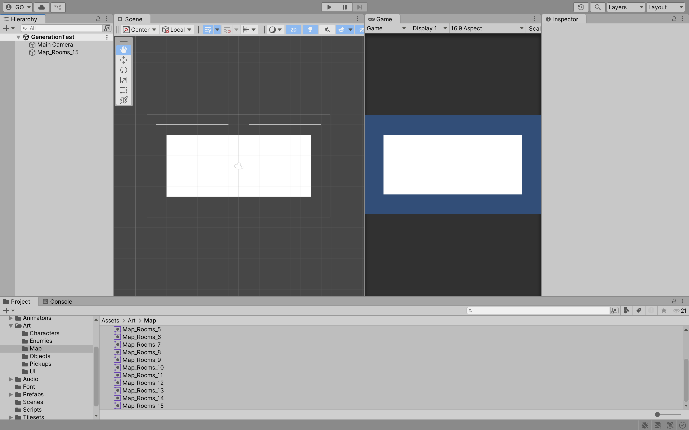
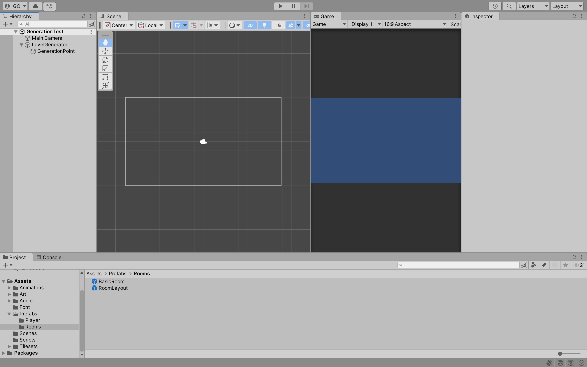
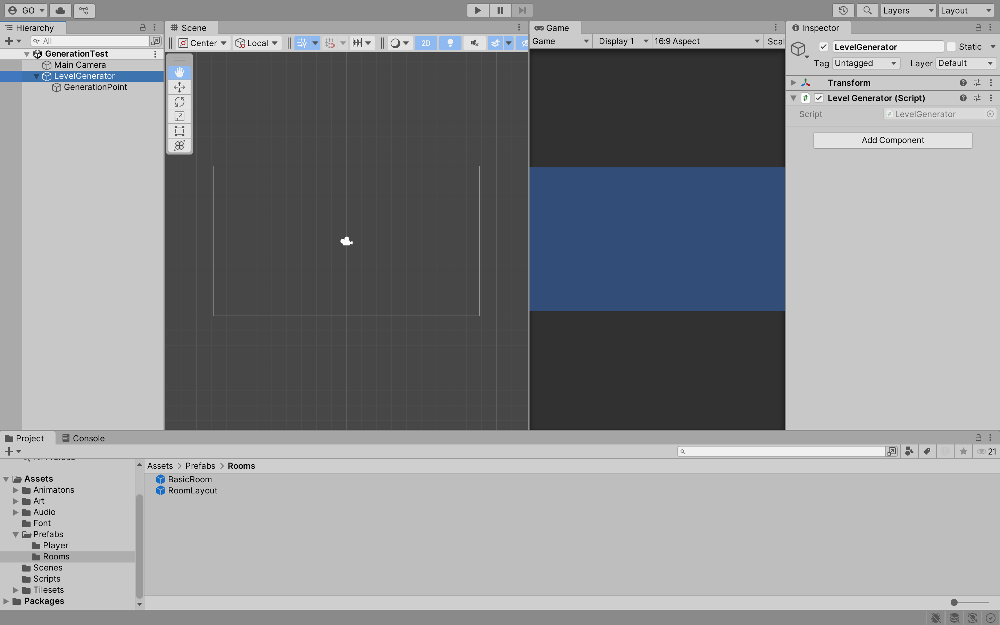
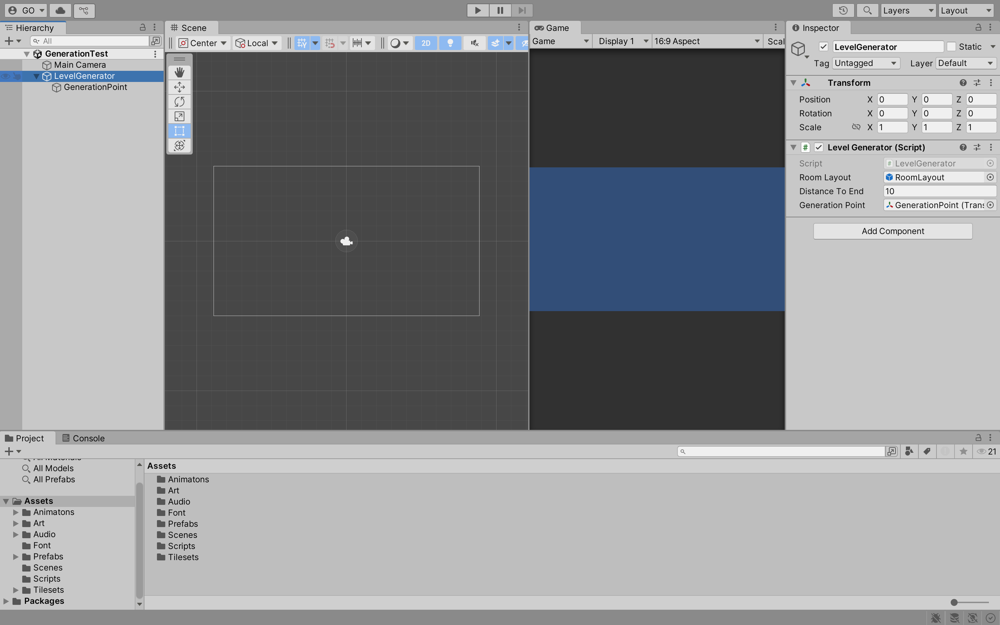
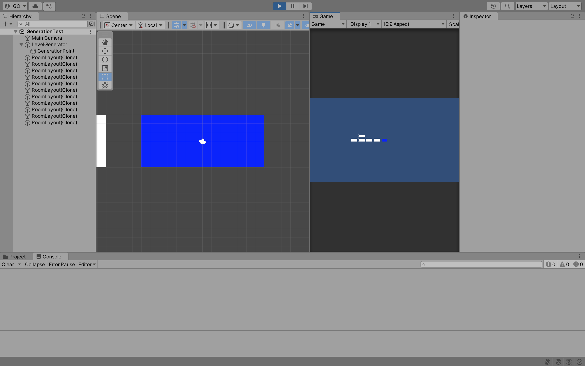

## Week 09

## Previous Class

Link to the previous class: [Week 08](https://github.com/otago-polytechnic-bit-courses/ID623001-introductory-game-development/blob/main-s1-25/lecture-notes/08-animation-tilemaps-tile-palettes.md)

---

## Rogue-Like Game

In this module, you will continue to develop **Rogue-Like** using Unity.

> **Note:** The following content does not take into account last week's formative assessment. Please ensure you have completed the formative assessment before continuing with this week's content. 

---

## Random Generation

**Random Generation** is a technique used in game development to create content that is not pre-defined. This can include levels, items, enemies and more. 

In the **Hierarchy** window, remove the `SampleScene`. Create a new **Scene** called `GenerationTest`. In the **Assets > Art > Map** folder, drag and drop `Map_Rooms_15` into the **Hierarchy** window. This will create a new **Game Object** called `Map_Rooms_15`.



In the **Hierarchy** window, create a new **Game Object** called `LevelGenerator` and a child **Game Object** called `GenerationPoint`. The `LevelGenerator` will be responsible for generating the levels, while the `GenerationPoint` will be used to determine where the next room will be generated.


Rename `Map_Rooms_15` to `RoomLayout` and drag and drop it into the **Prefabs > Rooms** folder. Delete the `RoomLayout` from the **Hierarchy** window.



In the **Assets > Scripts** folder, create a new script called `LevelGenerator` and attach it to the `LevelGenerator` **Game Object**. 



Open the script and add the following code:

```cs
// Omitted for brevity

public class LevelGenerator : MonoBehaviour
{
    [SerializeField] private GameObject roomLayout;
    [SerializeField] private int distanceToEnd;
    [SerializeField] private Transform generationPoint;

    private Color startColor = Color.blue;
    private Color endColor = Color.red;

    void Start()
    {
        GameObject room = Instantiate(roomLayout, generationPoint.position, generationPoint.rotation);
        SpriteRenderer sr = room.GetComponent<SpriteRenderer>();
        if (sr != null)
        {
            sr.color = startColor;
        }
    }
}
```

Click on the `LevelGenerator` **Game Object** and in the **Inspector** window, drag and drop the `RoomLayout` **Prefab** into the `Room Layout` field, set the `Distance To End` to `10` and drag and drop the `GenerationPoint` **Game Object** into the `Generation Point` field.



Click on the `Play` button. You should see a blue room appear in the **Scene** window.

---

## More Rooms

Currently, the `LevelGenerator` only generates one room. You need to write the code to generate more rooms. In the `LevelGenerator` script, add the following code:


```cs
// Omitted for brevity
using UnityEngine.SceneManagement;

public class LevelGenerator : MonoBehaviour
{
    // Omitted for brevity

    [SerializeField] private enum Direction
    {
        Up,
        Down,
        Left,
        Right
    }
    [SerializeField] private Direction direction;
    [SerializeField] private float xOffset = 18f;
    [SerializeField] private float yOffset = 10f;

    void Start()
    {
        // Omitted for brevity

        direction = (Direction)Random.Range(0, 4);
        MoveGenerationPoint();

        for (int i = 0; i < distanceToEnd; i++)
        {
            Instantiate(roomLayout, generationPoint.position, generationPoint.rotation);

            direction = (Direction)Random.Range(0, 4);
            MoveGenerationPoint();
        }
    }

    void Update()
    {
        if (Input.GetKeyDown(KeyCode.R))
        {
            SceneManager.LoadScene(SceneManager.GetActiveScene().name);
        }
    }

    private void MoveGenerationPoint()
    {
        switch (direction)
        {
            case Direction.Up:
                generationPoint.position += new Vector3(0, yOffset, 0);
                break;
            case Direction.Down:
                generationPoint.position += new Vector3(0, -yOffset, 0);
                break;
            case Direction.Left:
                generationPoint.position += new Vector3(-xOffset, 0, 0);
                break;
            case Direction.Right:
                generationPoint.position += new Vector3(xOffset, 0, 0);
                break;
        }
    }
}
```

What is happening in the code above?

- `Direction` enum is used to determine the direction in which the next room will be generated.
- `direction` variable is used to store the current direction.
- `xOffset` and `yOffset` variables are used to determine the distance between the rooms.
- `MoveGenerationPoint` method is used to move the `GenerationPoint` **Game Object** in the direction specified by the `direction` variable.
- `Start` method generates the first room and then generates the rest of the rooms in a random direction.

Click on the `Play` button. You should see a series of rooms generated in a random direction. Press `R` to regenerate the rooms.



---