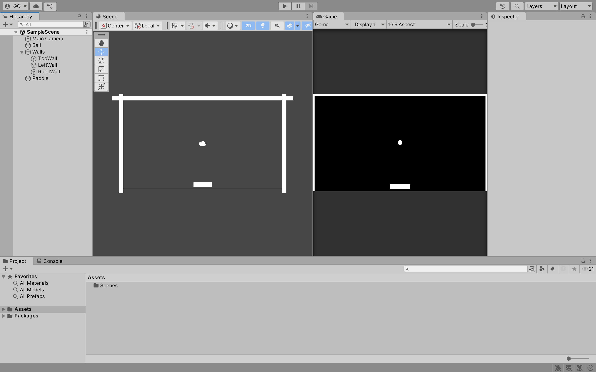
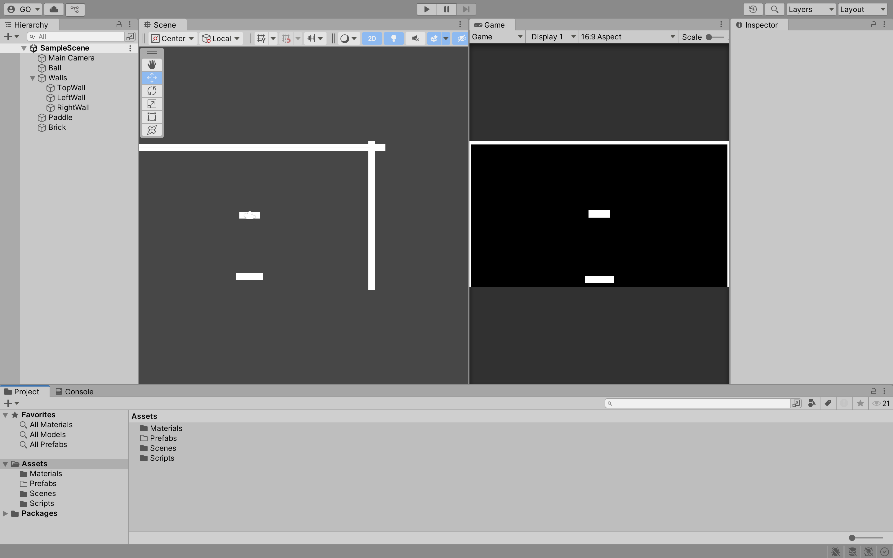
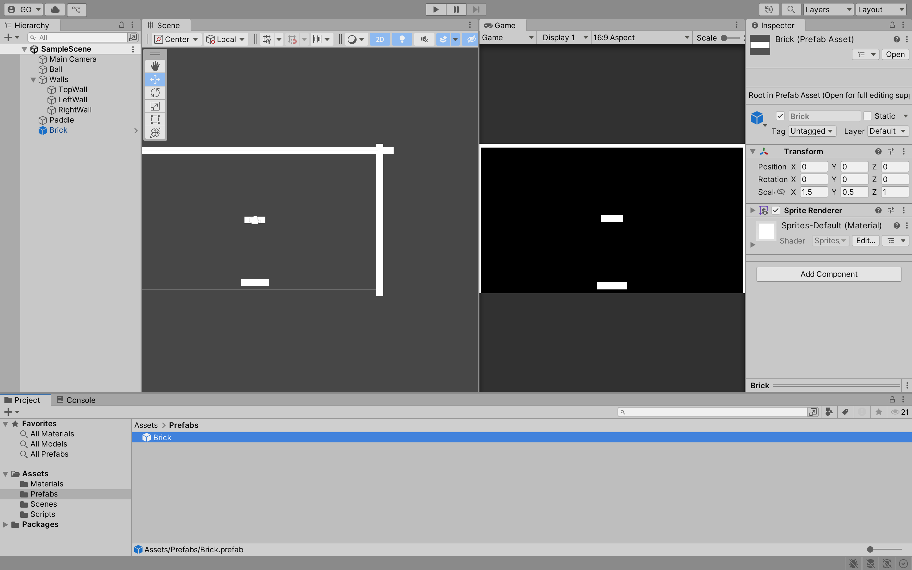
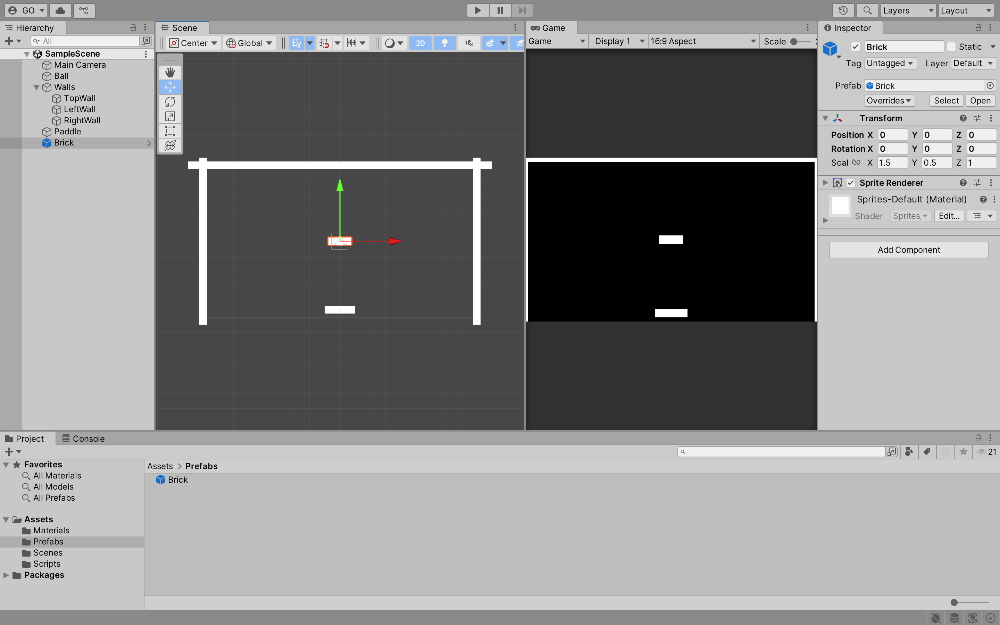
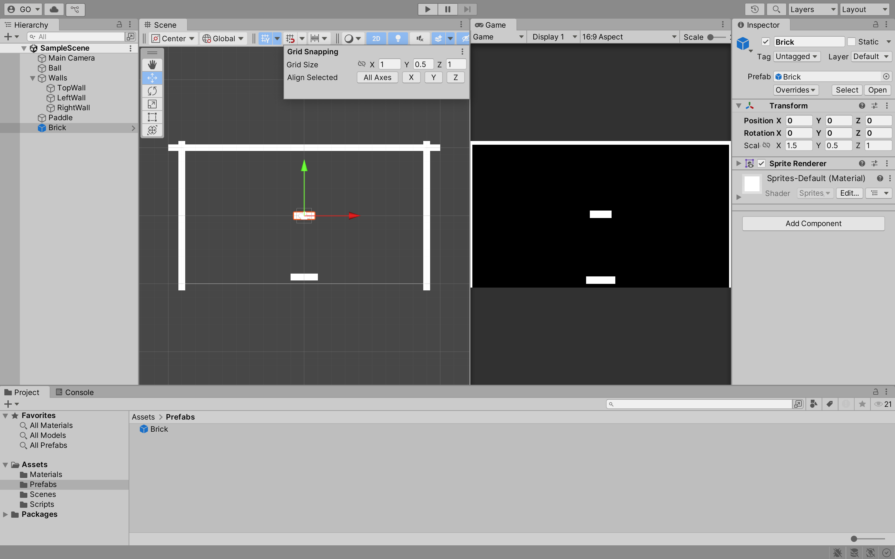
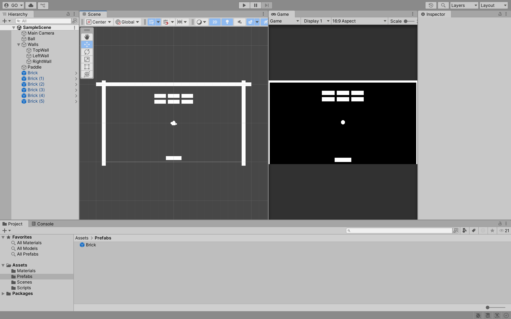
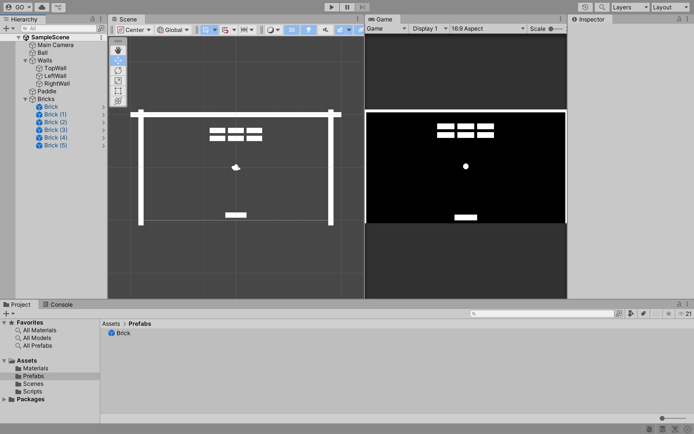

## Week 02

## Previous Class

Link to the previous class: [Week 02](https://github.com/otago-polytechnic-bit-courses/ID623001-introductory-game-development/blob/main-s1-25/lecture-notes/02-physic-material-2d-tag-canvas-text.md)

---

## Breakout Game

In this module, you will continue to develop **Breakout** using Unity.

---

## Sprites

Setup your scene with `Ball`, `TopWall`, `LeftWall`, `RightWall` and `Paddle` sprites.

> **Note:** YYou can organise your **GameObjects** in the Hierarchy window. For example, you can create an empty **GameObject** and name it `Walls` and then drag all the wall **GameObjects** under it.



**Task:**

1. Add a **Box Collider 2D** component to the `TopWall`, `LeftWall` and `RightWall` sprites.

---

## Paddle

Add a **Rigidbody 2D** and a **Box Collider 2D** component to the `Paddle` sprite. 

**Tasks:**

1. Set the `Gravity Scale` to `0`. 
2. Prevent the `Paddle` sprite from rotating.
3. Prevent the `Paddle` sprite from moving in the Y-axis.

Create a new script called `PaddleController` and attach it to the `Paddle` sprite.

```csharp
using System.Collections;
using System.Collections.Generic;
using UnityEngine;

public class PaddleController : MonoBehaviour
{
    [SerializeField] private Rigidbody2D rb;
    [SerializeField] private float speed = 2f;

    private float direction;

    void Update()
    {
        if (Input.GetKey(KeyCode.RightArrow))
        {
            direction = 1f;
        }
        else if (Input.GetKey(KeyCode.LeftArrow))
        {
            direction = -1f;
        }
        else
        {
            direction = 0f;
        }

        rb.linearVelocity = new Vector2(direction, 0f) * speed;
    }
}
```

Click the **Play** button to test the game. You should be able to move the `Paddle` sprite left and right.

---

## Multiple Inputs

Currently, the `Paddle` sprite can only be moved using the arrow keys. Let us add support for the `A` and `D` keys. Update the `PaddleController` script as follows:

```csharp
// Omitted for brevity

public class PaddleController : MonoBehaviour
{
    // Omitted for brevity

    void Update()
    {
        if (Input.GetKey(KeyCode.RightArrow) || Input.GetKey(KeyCode.D))
        {
            direction = 1f;
        }
        else if (Input.GetKey(KeyCode.LeftArrow) || Input.GetKey(KeyCode.A))
        {
            direction = -1f;
        }

        // Omitted for brevity
    }
}
```

Click the **Play** button to test the game. You should be able to move the `Paddle` sprite left and right using the arrow keys and the `A` and `D` keys.

---

## Fixed Update

The `Update` method is called once per frame. If you are using physics in your game, you should use the `FixedUpdate` method instead. The `FixedUpdate` method is called at a fixed interval and is independent of the frame rate.

Update the `PaddleController` script to use the `FixedUpdate` method:

```csharp
// Omitted for brevity

public class PaddleController : MonoBehaviour
{
    // Omitted for brevity

    void FixedUpdate()
    {
        rb.velocity = new Vector2(direction, 0f) * speed;
    }

    void Update()
    {
        if (Input.GetKey(KeyCode.RightArrow) || Input.GetKey(KeyCode.D))
        {
            direction = 1f;
        }
        else if (Input.GetKey(KeyCode.LeftArrow) || Input.GetKey(KeyCode.A))
        {
            direction = -1f;
        }
        else
        {
            direction = 0f;
        }
    }
}
```

**Task:**

1. In your **Pong** game, update the `PlayerController` script to use the `FixedUpdate` method.

---

## Ball

Add a **Rigidbody 2D** and a **Circle Collider 2D** component to the `Ball` sprite. 

**Tasks:**

1. Set the `Gravity Scale` to `0`.
2. Prevent the `Ball` sprite from rotating.
3. Add a new **Physics Material 2D** called `BounceMaterial` and set the `Bounciness` to `0.987`.
4. In the **Rigidbody 2D** component, set the `Material` to `BallPhysicsMaterial`.

Create a new script called `BallController` and attach it to the `Ball` sprite.

```csharp
using System.Collections;
using System.Collections.Generic;
using UnityEngine;

public class BallController : MonoBehaviour
{
    [SerializeField] private Rigidbody2D rb;
    [SerializeField] private float speed = 2f;

    Vector2 startPos;

    void Start()
    {
        startPos = transform.position;

        Reset();
    }

    void FixedUpdate()
    {
        rb.velocity = rb.velocity.normalized * speed; 
    }

    public void Reset() 
    {
        transform.position = Vector3.zero;

        float x = 0;

        int randNum = Random.Range(0, 2);

        if (randNum == 0)
        {
            x = 1f;
        }
        else if (randNum == 1)
        {
            x = -1f;
        }

        rb.velocity = new Vector2(x, 1f) * speed;
    }
}
```

---

## Prefabs

**Prefabs** are pre-configured **GameObjects** that you can reuse in your game. 

Create a new sprite called `Brick`. In the **Assets** folder, create a new folder called `Prefabs`.



Drag the `Brick` sprite into the `Prefabs` folder to create a **Prefab**. 



---

## Grid Snap

**Grid Snap** allows you to align **GameObjects** to a grid. This is useful when you want to align **GameObjects** in your scene.

Change the **Toggle Tool Handle Rotation** to **Global** and toggle the visibility of the **Grid**.



In **Grid Snapping**, set the **Grid Size** to `0.5`.



**Tasks:**

1. Add six `Brick` **Prefabs** to your scene.

Your scene should look like this:



2. Create a **GameObject** called `Bricks` and drag all the `Brick` **GameObjects** under it.



---